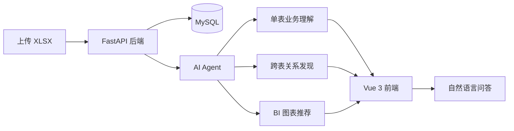
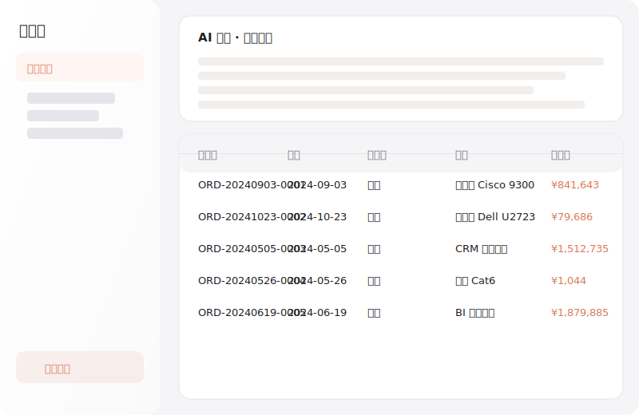
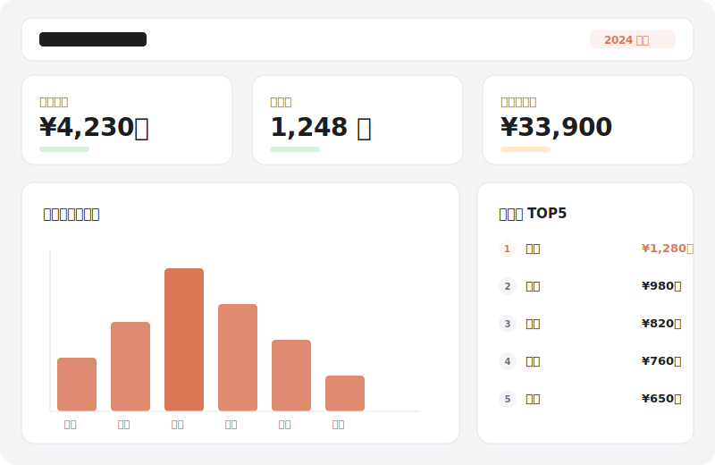
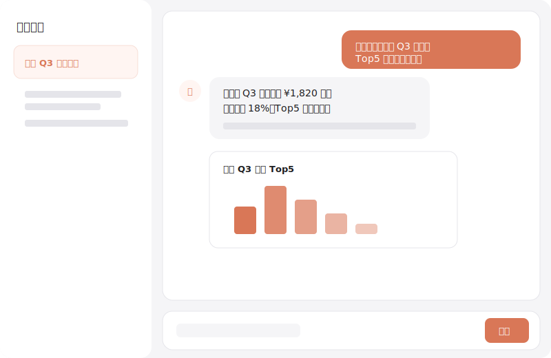

<p align="center">
  <a href="https://shaoxia20240902.github.io/Parsight/" target="_blank">
    
  </a>
</p>

<h1 align="center">Parsight / 析见</h1>

<p align="center">
  <strong>把 Excel 变成会说话的 BI 看板</strong> · AI 自动理解 · 跨表关联 · 自然语言问答
</p>

<p align="center">
  <a href="https://github.com/shaoxia20240902/Parsight/blob/main/LICENSE"></a>
  <a href="https://github.com/shaoxia20240902/Parsight/stargazers"></a>
  <a href="https://shaoxia20240902.github.io/Parsight/"></a>
  
  
  
</p>

<p align="center">
  <a href="https://shaoxia20240902.github.io/Parsight/">官网</a> ·
  <a href="./docs/README.md">文档</a> ·
  <a href="https://github.com/shaoxia20240902/Parsight/issues">反馈问题</a> ·
  <a href="https://github.com/shaoxia20240902/Parsight/issues/new">提需求</a>
</p>

---

## 这是什么？

Parsight 是一款面向 Excel / XLSX 数据的智能 BI 应用。

上传一张或多张表格后，系统会自动完成**结构解析、业务理解、跨表关联、看板生成**，并通过自然语言问答让你像聊天一样追问数据。

不需要写 SQL，不需要搭建数据仓库，不需要手工配置 BI 工具。



## 核心能力

| 能力 | 说明 | 价值 |
|------|------|------|
| **XLSX 上传与解析** | 自动识别 Sheet 结构、字段类型并写入 MySQL | 省去手工建表和清洗 |
| **AI 单表理解** | 六维业务理解，输出 Markdown 报告 | 让业务语义清晰可见 |
| **跨表关联分析** | 在空间内自动发现多表关系并生成 SQL | 替代 VLOOKUP 与手动 JOIN |
| **自动 BI 看板** | 自动推荐指标、维度、图表类型 | 一键生成 KPI、趋势、排名、占比图 |
| **自然语言问答** | 快速洞察 / 深度研究 / BI Builder 三种模式 | 中文提问，秒级得到答案 |
| **空间与后台管理** | 多空间隔离、LLM 配置、用户与审计日志 | 适配团队协作与私有化部署 |

## 产品预览

<table align="center">
  <tr>
    <td align="center" width="33%">
      <b>数据管理 + AI 理解</b><br />
      
    </td>
    <td align="center" width="33%">
      <b>自动 BI 看板</b><br />
      
    </td>
    <td align="center" width="33%">
      <b>自然语言问答</b><br />
      
    </td>
  </tr>
</table>

## 适用场景

- **销售管理**：区域业绩、销售员排名、目标达成、Top/尾部客户分析
- **运营分析**：库存周转、订单履约、客户留存、异常波动监控
- **财务对账**：收入汇总、预算 vs 实际、跨表差异核对
- **市场洞察**：客户分群、产品表现、趋势预测

## 快速开始

需要：MySQL、Python 3.10+、Node.js 18+。

```bash
# 1. 克隆仓库
git clone https://github.com/shaoxia20240902/Parsight.git
cd Parsight

# 2. 准备后端配置
cd backend && cp .env.example .env
# 编辑 .env，至少配置 DATABASE_URL 与 JWT_SECRET_KEY

# 3. 一键启动前后端
cd .. && ./start.sh
```

启动后访问：

- 前端：`http://localhost:3000`
- 后端 API：`http://localhost:8007`
- API 文档：`http://localhost:8007/docs`

默认管理员账号为 `admin`，首次启动密码见后端日志（或在 `.env` 中设置 `ADMIN_INITIAL_PASSWORD`）。登录后请在 **管理后台 → LLM 配置** 启用一条模型配置，AI 功能即可正常使用。

## 配置摘要

| 变量 | 必需 | 说明 |
|------|------|------|
| `DATABASE_URL` | 是 | MySQL 连接串，如 `mysql+aiomysql://root:密码@127.0.0.1:3306/xlsx_to_bi?charset=utf8mb4` |
| `JWT_SECRET_KEY` | 是 | 长度 ≥ 32 位的随机字符串，用于 Token 签名 |
| `ADMIN_INITIAL_PASSWORD` | 否 | 管理员初始密码；不设置时系统生成一次性随机密码 |
| `CORS_ALLOW_ORIGINS` | 否 | 多来源用英文逗号分隔，生产环境必须显式配置 |
| `OSS_*` | 否 | 可选的阿里云 OSS 配置 |

完整环境变量说明见 [`backend/.env.example`](./backend/.env.example)。

## 项目结构

```text
Parsight/
├── backend/          # FastAPI 后端、AI Agent、数据服务
│   ├── app/
│   ├── tests/
│   ├── requirements.txt
│   └── pyproject.toml
├── frontend/         # Vue 3 + Vite 前端
│   ├── src/
│   └── package.json
├── docs/             # 架构文档与官网落地页
├── mock_data/        # 示例 XLSX 数据
└── start.sh          # 一键启动脚本
```

## 文档

- [docs/README.md](./docs/README.md) — 文档索引
- [docs/DEVELOPMENT.md](./docs/DEVELOPMENT.md) — 架构、API、数据模型与开发规范
- [docs/PROJECT_VALUE.md](./docs/PROJECT_VALUE.md) — 项目价值与开源方向

## 技术栈

<p align="left">
  
  
  
  
  
  
  
  
</p>

## 贡献

欢迎 Fork 并提交 Pull Request。

- 提交信息建议遵循 [Conventional Commits](https://www.conventionalcommits.org/)
- 前端代码遵循 [`CLAUDE.md`](./CLAUDE.md) Apple 极简设计规范
- 代码变更请同步更新 [`docs/`](./docs) 对应文档

## Star History

<p align="center">
  <a href="https://github.com/shaoxia20240902/Parsight/stargazers">
    
  </a>
</p>

## License

[MIT License](./LICENSE) · Built by [shaoxia20240902](https://github.com/shaoxia20240902)
