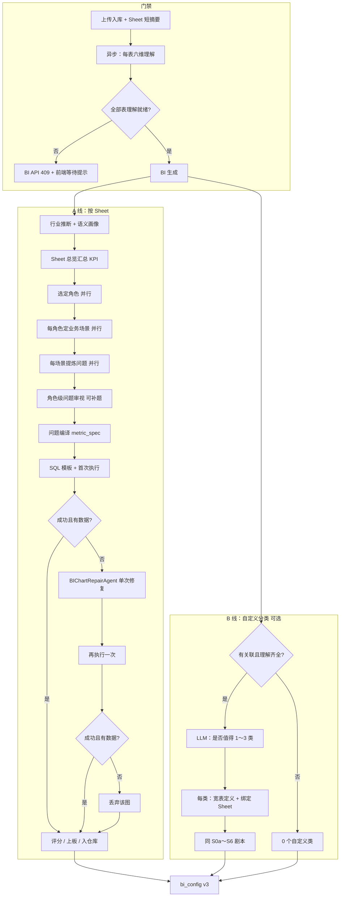

# BI 看板深度优化方案（开发版）

> **产品对齐**：[BI_VISION.md](./BI_VISION.md)（自然语言，说明「要做什么」）  
> **契约与 v2 结构**：[BI_DASHBOARD_MODULE.md](./BI_DASHBOARD_MODULE.md)  
> **本文**：目标架构、流水线、Agent、数据模型、与现状差异、实施分期。

---

## 1. 产品目标（已确认）

| 原则 | 说明 |
|------|------|
| **场景先于问题** | 角色 → **业务场景** → 具体问题 →（角色审视是否补题）→ SQL；场景作为 SQL 口径上下文 |
| **Sheet 总览必有** | 每 Sheet 先生成总览汇总 KPI（规模、核心指标总量等），默认上板置顶 |
| **问题驱动** | 每张图对应一个业务问题；经场景与审视后再生成 SQL 与图表 |
| **深度 KPI** | 大量 KPI 需计算（占比、达成率、趋势、环比/同比、留存类派生等），不能只做 `SUM` 排行榜 |
| **视角由数据决定** | LLM 根据表内容、行业、六维理解**选择**分析角色与问题类型；**不强制**环比/同比 |
| **六维理解是硬门禁** | 无 `understanding_content` 的 Sheet **禁止**生成 BI；前端提示等待或重新生成理解 |
| **理解异步化** | 上传入库后**异步**跑表理解；BI 与上传解耦，理解就绪后再生成 |
| **Sheet 线 + 自定义线** | 单表走标准剧本；跨表在有关联 + 各表理解齐全时，**可选** 1～3 个自定义分类（逻辑宽表） |
| **通用模板 + 并行** | 统一 JSON 骨架（行业、角色占位、问题列表）；角色级 / 问题级任务并行 |
| **失败透明** | 某题 SQL 不可算则跳过并在 `generation_report` 记录，不 Mock |
| **单图单次修复** | SQL 报错或结果为空 → 修复智能体判断改 SQL 或改问题 → **仅再执行 1 次**；仍失败则丢弃该图，不阻断整表生成 |

---

## 2. 现状 vs 目标

### 2.1 上传与理解（当前代码）

```text
run_post_upload_analysis()  # upload.py
  对每个 Sheet 串行：
    Sheet 短摘要 (LLM)
    六维理解 (LLM) → save_understanding_draft + 后台核对
  全部完成后：
    BIBusinessGenerator.generate()  # 未读取 understanding_content
```

| 项 | 现状 | 目标 |
|----|------|------|
| 表理解时机 | 上传流程内**同步**，阻塞 BI | 上传后**异步**任务，不阻塞「文件已导入」状态 |
| BI 是否校验理解 | ❌ 未校验 | ✅ 每 Sheet 必须有 `understanding_content` |
| BI 是否用理解 | ❌ 仅用 summary + columns | ✅ 理解全文（可截断）+ 行业推断 |
| BI 触发 | 上传结束自动生成 | 理解齐全后：用户点击生成 / 可选自动触发 |

### 2.2 看板生成（当前 v2）

```text
BIProfiler → BIPlanner(分类命名) → 规则模板 SQL → 预览校验
```

| 项 | 现状 | 目标 |
|----|------|------|
| 多角色分析 | 无 | 每 Sheet 2～4 角色并行 |
| 问题 → 图 | 固定模板（KPI/柱/饼/线） | 每题一图，题型由 `analysis_type` 决定 |
| 环比/同比 | 无 | 模板库**可选**实现，由 LLM 选题触发 |
| 行业针对性 | 无 | `industry_guess` 影响角色与问题 |
| 自定义分类 | JOIN 检测 + 简单 JOIN 表 | 关联 Markdown + 各表理解 → 判断是否 1～3 类 → 宽表逻辑 + 同剧本 |

---

## 3. 目标总架构



---

## 4. 硬门禁：六维理解

### 4.1 就绪定义

对 `file_id` 下每个 `sheet_meta`：

| 条件 | 要求 |
|------|------|
| `understanding_content` | 非空（`verifying` 期间可用初稿 `understanding_content_initial` 若终稿尚未写入） |
| 终稿优先 | `verification_status=completed` 时用终稿；`verifying` 用初稿；`failed` 若无内容则视为未就绪 |

**API 行为**（`POST /api/bi/generate/{file_id}`）：

```json
HTTP 409
{
  "detail": "以下表尚未完成六维理解，无法生成 BI",
  "pending_tables": ["zhangsan_1_销售明细"],
  "action": "wait_or_regenerate_understanding"
}
```

前端 `BIView`：展示列表 + 跳转数据页 +「重新生成理解」入口。

### 4.2 上传后异步理解

调整 `run_post_upload_analysis`：

```text
1. Sheet 短摘要（可保持串行或按 Sheet 并行）
2. 为每表 enqueue 理解任务（BackgroundTasks / 任务表）
3. file.status = uploaded | analyzing_understanding（新状态可选）
4. 不再在此处调用 BIBusinessGenerator
5. 理解全部就绪 → file.status = understanding_ready（或保持 analyzed 仅在有 BI 时）
```

可选：空间内「全部表理解完成」后发通知 / 允许「一键生成 BI」。

---

## 5. 通用分析模板（LLM 填空）

所有 **Sheet 分类** 与 **自定义分类** 共用 `BIAnalysisBlueprint` 结构；**禁止** LLM 输出 SQL。

### 5.1 顶层：文件 / 空间级（生成前一次）

```json
{
  "industry_guess": {
    "primary": "sales|operations|supply_chain|hr|finance|general",
    "confidence": 0.82,
    "signals": ["字段含销售额/区域", "Sheet 名销售明细"],
    "analysis_hints": ["关注区域贡献与达成", "时间序列适合看趋势而非同比"]
  },
  "file_summary": "一份多 Sheet 的销售执行数据..."
}
```

**Agent：`BIIndustryInferenceAgent`**  
输入：各表理解摘要 + 表名 + 字段名样本 + `key_metrics`  
输出：仅 `industry_guess` + `file_summary`

### 5.2 Sheet 级蓝图

```json
{
  "scope": "sheet",
  "table_name": "user_1_销售明细",
  "sheet_name": "销售明细",
  "business_one_liner": "按订单粒度记录的销售事实表",
  "sheet_summary": {
    "display_name": "经营总览",
    "summary_intents": [
      {
        "intent_id": "sum_sales",
        "title": "销售总额",
        "analysis_type": "kpi",
        "metrics": ["销售额"],
        "priority": 100
      },
      {
        "intent_id": "sum_orders",
        "title": "订单量",
        "analysis_type": "kpi",
        "metrics": ["订单数"],
        "priority": 99
      }
    ]
  },
  "perspectives": [
    {
      "perspective_id": "regional_manager",
      "role_name": "区域销售负责人",
      "role_background": "关心各区域业绩排名、短板区域和短期趋势",
      "priority": 90,
      "scenarios": [
        {
          "scenario_id": "monthly_review",
          "scenario_name": "月底区域复盘",
          "scenario_context": "月度复盘时需要判断区域贡献是否均衡、是否存在过度依赖",
          "focus_metric_types": ["share", "ranking"],
          "available_dimensions": ["区域"],
          "questions": [
            {
              "question_id": "q1",
              "question": "各区域销售额贡献如何，是否过度依赖单一区域？",
              "user_intent": "看结构集中度",
              "analysis_type": "structure",
              "metrics": ["销售额"],
              "dimensions": ["区域"],
              "time_field": null,
              "priority": 95
            }
          ]
        }
      ],
      "question_review": {
        "coverage_ok": false,
        "gaps": ["缺少近期趋势或增长节奏判断"],
        "need_more_questions": true,
        "additional_questions": [
          {
            "question_id": "q1_add",
            "scenario_id": "monthly_review",
            "question": "近几个月销售额增速是在加快还是放缓？",
            "analysis_type": "trend",
            "metrics": ["销售额"],
            "time_field": "订单日期",
            "priority": 88
          }
        ]
      }
    }
  ],
  "warnings": []
}
```

**结构约束**：

| 层级 | 内容 | 禁止 |
|------|------|------|
| `sheet_summary` | 总览 KPI intents，**每 Sheet 必有** | 用场景化长分析替代总览 |
| `perspectives[]` | 仅角色身份 + `role_background` | 在选角步骤写 `questions` |
| `scenarios[]` | 业务情境、关注点、可用维度和时间 | 把场景写成问句 |
| `scenarios[].questions[]` | 可落地的具体问题 + `analysis_type` | 无场景挂靠的孤立问题 |
| `question_review` | 覆盖度判断 + 补题 | 补题不执行则跳过本层 |

**占位符说明**：

| 字段 | 谁填 | 用途 |
|------|------|------|
| `role_name` / `role_background` | LLM（S1） | 选角，不出题 |
| `scenario_*` | LLM（S2） | SQL 生成器的业务上下文 |
| `questions[]` | LLM（S3） | 挂在场景下 |
| `question_review` | LLM（S3b） | 角色级补题 |
| `analysis_type` | LLM 选枚举 | 后端选 SQL 模板 |
| `derived_kpi_hint` | LLM | 表无列名时的派生意图 |

### 5.3 自定义分类级蓝图

```json
{
  "scope": "custom_category",
  "category_draft": {
    "name": "客户经营全景",
    "description": "客户主数据与销售明细关联后的综合分析",
    "relationship_id": "rel_1",
    "bound_sheets": [
      { "sheet_name": "客户信息", "table_name": "...", "role": "dimension" },
      { "sheet_name": "销售明细", "table_name": "...", "role": "fact" }
    ],
    "wide_table_spec": {
      "grain": "客户_id",
      "join_path": [
        { "left": "销售明细.客户ID", "right": "客户信息.客户ID", "type": "inner" }
      ],
      "available_metrics": ["销售额", "订单数"],
      "available_dimensions": ["客户等级", "区域"]
    }
  },
  "perspectives": [ "..." ],
  "warnings": []
}
```

**Agent：`BICustomCategoryAdvisorAgent`**  
输入：`spaces.relations_content` + 各表 `understanding_content` 摘要 + `BIProfiler.detect_relationships` 结果  
输出：`custom_categories` 数组，长度 **0～3**；长度为 0 时明确 `skip_reason`

---

## 6. A 线：单 Sheet 流水线（开发步骤）

| 步骤 | 模块 | 输入 | 输出 | 并行 |
|------|------|------|------|------|
| S0 | `BIProfiler` + 理解注入 | 表 + understanding | `field_profiles`, `time_coverage` | 按 Sheet |
| S0b | `BIIndustryInferenceAgent` | 多表摘要 | `industry_guess` | 单次/按文件 |
| **S0a** | **`BISheetSummaryPlanner`**（代码为主，LLM 可选命名） | profile + understanding | `sheet_summary.summary_intents[]` | 按 Sheet |
| S1 | `BISheetRolePickerAgent` | profile + understanding + industry | `perspectives[]`（**仅** role + background） | 按 Sheet 一次或按角色并行 |
| S2 | `BIScenarioAgent` | 单 perspective + profile | `scenarios[]`（无 questions） | **按 perspective 并行** |
| S3 | `BIScenarioQuestionAgent` | 单 scenario + profile | `scenario.questions[]` | **按 scenario 并行** |
| **S3b** | **`BIQuestionReviewAgent`** | perspective + 全部 scenarios/questions | `question_review`，合并补题 | 按 perspective |
| S4 | `MetricSpecCompiler` | question + **scenario_context** | `metric_spec` | 按 question |
| S5 | `BISQLBuilder` + Validator + 首次 `execute` | metric_spec | `sql` + 执行结果或错误 | 按 question 并行限流 |
| **S5f** | **`BIChartRepairAgent`** | 失败上下文（见 §6.7） | `repair_action` + 新 question 或新 sql | 仅失败题触发，**每图最多 1 次** |
| S5b | 再次 `execute` | 修复后 sql/question | 二次结果 | 同上 |
| S6 | `BIChartRanker` | **仅成功** charts | 总览置顶 + `on_board` + 仓库裁剪 | 按 Sheet |

**合并调用（控成本）**：S1+S2 或 S2+S3 可合并为单次 LLM，但 JSON  schema 须保持「场景 ≠ 问题」分层；S3b 建议独立一次调用以便审视补题。

### 6.1 Sheet 总览（S0a）

- 从 `field_profiles` 选出 **2～5 个**核心 metric，生成 `analysis_type=kpi` 的总览 intents。
- 可选：总量、达成率（有目标字段时）、最近一期快照。
- 生成 chart 时 `perspective_id=sheet_summary`，`board_order` 最小（置顶）。
- 总览 **不经过** 角色场景剧本，但同样走 SQL 预览校验。

### 6.2 角色与场景（S1～S2）

- LLM 根据 `industry_guess` + 理解选择 **2～4** 个 `perspectives`。
- 每角色 **1～3** 个 `scenarios`；场景必须包含 `scenario_context`（决策情境），不得是问句形式。
- 可参考深度洞察角色库作候选，不要求固定「三角色」。

### 6.3 问题审视（S3b）

`BIQuestionReviewAgent` 输入该角色下所有场景与已出题，输出：

```json
{
  "coverage_ok": false,
  "gaps": ["缺少趋势类问题"],
  "need_more_questions": true,
  "additional_questions": [ "..."]
}
```

规则：

- `need_more_questions=false` 且 `coverage_ok=true` → 直接进入 S4。
- 补题必须挂到 `scenario_id`（已有或 `scenario_id: "_supplement"` 补充场景）。
- 补题总数建议每角色 **0～3**，避免无限扩张。
- 合并后 `all_questions = scenarios[].questions + additional_questions`。

### 6.4 `MetricSpecCompiler` 与场景上下文

编译 `metric_spec` 时注入：

```json
{
  "scenario_context": "月底区域复盘时需要判断区域贡献是否均衡",
  "role_name": "区域销售负责人",
  "question": "..."
}
```

`BISQLBuilder` 选模板时可优先场景声明的 `focus_metric_types`，提高口径一致性。

### 6.5 `analysis_type` 与模板库（后端实现）

LLM 只选类型；SQL 由模板生成。

| analysis_type | 典型场景 | 数据前置 | 说明 |
|---------------|----------|----------|------|
| `kpi` | 总规模 | metric 可聚合 | 单值 KPI |
| `trend` | 走势 | time_field + ≥3 期 | 折线，**不强制**环比 |
| `growth_rate` | 增速 | 同上 | 每期增长率或斜率感 |
| `mom` | 环比 | ≥2 连续周期 | **可选** |
| `yoy` | 同比 | 跨年或 ≥13 月 | **可选** |
| `share` / `structure` | 占比结构 | dimension | 饼/条 |
| `ranking` | Top/Bottom | dimension + metric | |
| `target_achievement` | 达成 | 实际+目标字段 | |
| `derived_kpi` | 留存、客单价等 | 由 hint + 字段推断 | 能算才算，否则 skip |
| `anomaly_list` | 异常清单 | 规则 + 排序 | table |
| `detail` | 明细钻取 | | table |

**选题原则（写入 Prompt）**：

- 仅 1～2 个时间桶 → 不出 mom/yoy，可出 `trend`。
- 运营/用户类行业 → 优先 `derived_kpi`（留存、活跃）若字段可推导。
- 销售类 → 结构 + 达成 + 趋势，环比/同比**仅在有足够历史时**加入。

### 6.6 问题 → 图 1:1

- 每个 `question` 最多生成 **1** 张 chart；chart 记录 `scenario_id`、`scenario_name`。
- 每 Sheet：总览 **2～5** 张 + 角色深度题 **6～12** 题；Ranker 后仓库上限仍遵守 v2（如 40），总览优先保留上板。

### 6.7 单图修复（S5f / S5b）— `BIChartRepairAgent`

**触发条件**（满足其一即可）：

| 类型 | 判定 |
|------|------|
| `sql_error` | `execute` 抛错或校验失败（含字段不存在、语法错误） |
| `empty_result` | 查询成功但 `rows` 为空，或 KPI 列全部为 `NULL` |

**不触发**：结果行数少但非空（如 Top3 只有 2 行）——视为有效，不修复。

**输入**（单次 LLM 调用）：

```json
{
  "failure_type": "sql_error|empty_result",
  "error_message": "Unknown column `区域名`",
  "question": { "question_id", "question", "analysis_type", "metrics", "dimensions", "time_field" },
  "scenario_context": "...",
  "metric_spec": { },
  "sql": "SELECT ...",
  "understanding_excerpt": "六维理解摘要（字段口径、粒度）",
  "field_profiles": [ "销售额: metric", "区域: dimension" ]
}
```

**输出**（JSON only，禁止 Markdown）：

```json
{
  "diagnosis": "sql_issue|question_issue",
  "diagnosis_reason": "引用了不存在的列 `区域名`，应为 `区域`",
  "repair_action": "fix_sql|fix_question",
  "revised_question": null,
  "revised_sql": "SELECT `区域`, SUM(...) ...",
  "revised_metric_spec": null
}
```

| `repair_action` | 行为 |
|-----------------|------|
| `fix_sql` | 采用 `revised_sql`（或根据 `revised_metric_spec` 重跑 `BISQLBuilder`），**问题文案可不变** |
| `fix_question` | 采用 `revised_question`（及必要时的 `analysis_type`/字段），再跑 S4→S5 生成新 SQL |

**硬规则**：

1. **每图仅 1 次修复机会**：S5 → S5f → S5b，之后不再循环。
2. 二次仍 `sql_error` 或 `empty_result` → 该题 `status=dropped`，**不写入** `charts[]`（或写入仓库但 `enabled=false`，推荐直接不入库）。
3. **禁止**因单图失败导致整个 `file_id` BI 生成中断（与当前 `_validate_previews` 整批 `raise` 的行为需改造）。
4. **禁止** Mock 行填充；空就是丢弃。
5. 修复智能体**只改 SQL 或只改问题**其一为主，不做多轮规划；`diagnosis` 供 `generation_report` 审计。

**`generation_report` 记录示例**：

```json
{
  "charts_dropped": [
    {
      "question_id": "q9",
      "title": "各城市同比",
      "failure_type": "empty_result",
      "diagnosis": "question_issue",
      "diagnosis_reason": "时间跨度不足一年，同比无意义",
      "repair_attempted": true,
      "final_status": "dropped_after_repair"
    }
  ]
}
```

**实现注意**：`fix_question` 后必须重新走 `MetricSpecCompiler` + `BISQLBuilder`，不能手写 SQL 绕过校验。

---

## 7. B 线：自定义分类（宽表）

### 7.1 触发条件（代码 + LLM）

1. `spaces.relations_content` 存在（用户已在关联页生成）。  
2. 参与关联的表 **全部** 通过理解门禁。  
3. `BIProfiler.detect_relationships` 至少 1 条 `overlap_count > 0`。  
4. `BICustomCategoryAdvisorAgent` 输出 1～3 个 `category_draft`，否则 0。

### 7.2 宽表逻辑

- 不物理建宽表；在 `wide_table_spec` 中声明 **grain + join_path + 可用指标/维度**。
- `BISQLBuilder` 增加 `scope=custom` 模式：基于 JOIN SQL 生成指标（与现 `relation_charts` 类似，但走 question → metric_spec 路径）。
- 每个自定义分类独立跑 S1～S5（角色、问题、图）。

### 7.3 与前端分类模型

| 字段 | 说明 |
|------|------|
| `source` | `custom` |
| `created_by` | `system`（推荐）或 `user` |
| `bound_sheets` | 绑定的 Sheet 列表，UI 可展示 |
| `relationship_id` | 可追溯 |
| 数量 | 系统推荐 **1～3**，用户手动创建仍遵守现 API 上限 3 |

---

## 8. 并行与限流

```python
# 伪代码
async def generate_sheet_bi(profile, understanding, industry):
    perspectives = await role_agent.run(...)  # 一次调用返回多角色
    question_tasks = [
        question_agent.run(perspective=p) for p in perspectives
    ]
    question_results = await gather_limited(question_tasks, sem=4)
    chart_tasks = [build_and_validate_chart(q) for q in all_questions]
    charts = await gather_limited(chart_tasks, sem=4)
    return rank(charts)
```

| 层级 | 并行单位 | 建议并发 |
|------|----------|----------|
| 文件 | 多 Sheet | 2～3 |
| Sheet | 多 perspective 出题 | 4 |
| Sheet | 多 question 出 SQL | 4 |
| 自定义类 | 多个 category | 2 |

LLM 调用次数估算（单 Sheet）：1（角色+题可合并为 2 步）+ 0～N；优先 **S1+S2 合并为单次 JSON**（每 Sheet 一次返回 perspectives+questions）以控成本，并行主要在 SQL 预览。

---

## 9. `bi_config` v3 扩展

在 v2 基础上增加：

```json
{
  "version": 3,
  "industry_guess": { "...": "..." },
  "understanding_snapshot_at": "ISO8601",
  "relations_snapshot_at": "ISO8601|null",
  "sheet_summary_charts": ["chart_summary_001"],
  "charts": [
    {
      "layer": "summary|role_analysis",
      "perspective_id": "regional_manager",
      "role_name": "区域销售负责人",
      "scenario_id": "monthly_review",
      "scenario_name": "月底区域复盘",
      "scenario_context": "月度复盘时需要判断区域贡献是否均衡",
      "question_id": "q1",
      "question": "各区域销售额贡献如何...",
      "from_review": false,
      "analysis_type": "structure",
      "metric_spec": { },
      "sql": "...",
      "scope": "sheet|custom"
    }
  ],
  "generation_report": {
    "understanding_gate": "passed",
    "questions_planned": 24,
    "charts_built": 20,
    "charts_skipped": [
      { "question_id": "q9", "reason": "时间跨度不足，未进入 SQL 阶段" }
    ],
    "charts_dropped": [
      { "question_id": "q12", "failure_type": "empty_result", "repair_attempted": true, "final_status": "dropped_after_repair" }
    ],
    "custom_categories_skipped_reason": "关联价值不足"
  }
}
```

---

## 10. Agent 清单（目标）

| ID | 类名（拟） | 职责 |
|----|------------|------|
| — | `TableUnderstandingAgent` | 已有；上传后异步 |
| B-IND | `BIIndustryInferenceAgent` | 行业推断 + 文件级 hints |
| B-SUM | `BISheetSummaryPlanner` | Sheet 总览 KPI intents（必有） |
| B-ROLE | `BISheetRolePickerAgent` | 仅选角色 + background |
| B-SCN | `BIScenarioAgent` | 每角色业务场景（不是问题） |
| B-Q | `BIScenarioQuestionAgent` | 每场景下出题 |
| B-REV | `BIQuestionReviewAgent` | 角色级审视 + 补题 |
| B-FIX | `BIChartRepairAgent` | SQL/空结果单次修复（改 SQL 或改问题） |
| B-CUS | `BICustomCategoryAdvisorAgent` | 0～3 自定义类 + wide_table_spec |
| — | `MetricSpecCompiler` | 代码：question → metric_spec |
| — | `BISQLBuilder` | 代码：metric_spec → SQL |
| — | `BIChartRanker` | 代码：评分与上板 |

**废弃/收敛**：`BIClassificationAgent` 全量生成；`regenerate-chart` 改走 question 路径。

---

## 11. API 与前端

| 变更 | 说明 |
|------|------|
| `POST /api/bi/generate/{file_id}` | 409 理解未就绪；SSE 步骤增加 `summary` / `roles` / `scenarios` / `questions` / `review` / `custom` |
| `GET /api/bi/config/{file_id}` | 支持 v3 |
| `GET /api/files` 或新接口 | 返回每表 `understanding_status`，供 BI 页门禁展示 |
| `BIView` | 未就绪态 UI；就绪后生成 |
| `ChartCard` | 可选展示 `question`、角色名 |

---

## 12. 实施分期

### Phase 0：门禁与异步理解（优先）

- [ ] 上传后 BI 解耦；理解 BackgroundTasks
- [ ] `BIBusinessGenerator` / `bi.py` 增加理解门禁 409
- [ ] 前端等待/重试理解
- [ ] `DEVELOPMENT.md` 更新数据流

### Phase 1：通用模板 + Sheet 线 MVP

- [ ] `BISheetSummaryPlanner`（总览 KPI 必有、置顶）
- [ ] `BIIndustryInferenceAgent`
- [ ] `BISheetRolePickerAgent` + `BIScenarioAgent` + `BIScenarioQuestionAgent`（分层 JSON，场景≠问题）
- [ ] `BIQuestionReviewAgent`（补题层）
- [ ] 注入 `understanding_content`（截断策略）
- [ ] `MetricSpecCompiler`（带 `scenario_context`）+ `BISQLBuilder`
- [ ] 问题 1:1 图表 + 首次预览
- [ ] `BIChartRepairAgent` + 单图二次执行；失败仅丢弃该图（改造 `_validate_previews` 勿整批 raise）
- [ ] 替换 `_generate_sheet_charts` 硬编码

### Phase 2：可选对比类 KPI + 派生

- [ ] mom/yoy/growth_rate 模板（条件触发）
- [ ] `derived_kpi` 有限集（客单价、复购率等）+ skip 报告
- [ ] Ranker 按视角多样性

### Phase 3：自定义宽表线

- [ ] 依赖 `relations_content`
- [ ] `BICustomCategoryAdvisorAgent` 1～3 类
- [ ] 宽表 JOIN SQL 路径
- [ ] 前端展示 `bound_sheets`

### Phase 4：体验

- [ ] 图表「计算说明」
- [ ] 理解完成后「一键生成 BI」
- [ ] `regenerate-chart` 统一管线

---

## 13. 验收标准

| # | 场景 | 通过标准 |
|---|------|----------|
| 1 | 上传后立刻进 BI | 409 或等待态，不生成空看板 |
| 2 | 理解齐全后生成 | 每 Sheet 有总览 KPI；每图有 `question` + `scenario_context` |
| 3 | 销售表 | 总览 + 场景化深度题；不强制同比 |
| 3b | 某角色仅 1 道浅题 | `question_review` 触发补题或 report 记录 gap |
| 4 | 仅 2 个月数据 | 无 yoy；可有 trend；report 记录 skip |
| 5 | 运营特征表 | 出题含留存/活跃类（能算则出图） |
| 6 | 无关联 | 0 系统自定义类 |
| 7 | 有关联 | 1～3 自定义类，每类声明绑定 Sheet |
| 8 | 筛选器 | 筛选后 SQL 结果变化正确 |
| 9 | 单图 SQL 报错 | 修复 1 次；仍失败则该图不出现，其他图正常 |
| 10 | 单图 0 行 | 同上，`charts_dropped` 有记录 |

---

## 14. 变更记录

| 日期 | 说明 |
|------|------|
| 2026-05-16 | 初版：五层架构、固定视角、环比/同比为主 |
| 2026-05-16 | **v2 重写**：对齐产品确认——理解硬门禁、异步理解、角色→问题→图、LLM 定视角、自定义宽表 1～3、行业推断、对比类 KPI 可选；新增 [BI_VISION.md](./BI_VISION.md) |
| 2026-05-16 | **v2.1**：增加 Sheet 总览汇总；流水线改为 角色→场景→问题→问题审视→SQL；场景作为 SQL 上下文 |
| 2026-05-16 | **v2.2**：增加 `BIChartRepairAgent`：SQL 错误/空结果单次修复（改 SQL 或改问题），再执行一次，仍失败则仅丢弃该图 |
