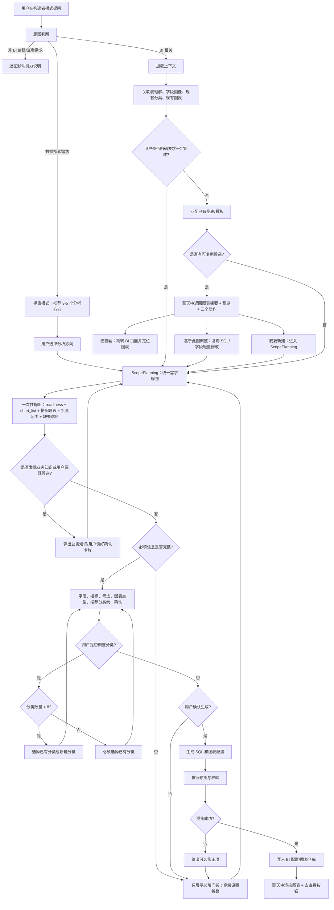

# BI 模块构建者智能体设计文档

> 目标：在问答页新增“BI 构建者”智能体。它不是直接替用户生成图表，而是先判断意图、复用现有 BI 看板能力、尽量用按钮和问卷收集缺失信息，最后在用户确认后创建或跳转到对应报表。

---

## 1. 设计结论

BI 构建者应作为 **对话编排层**，运行在现有 BI 生成与渲染能力之上：

- 当前不是 BI 创建需求：返回固定能力说明，不进入表理解、图表匹配或创建流程。
- 当前是 BI 创建或查看需求：先判断是否明确要求新建；如果明确新建，跳过已有图表匹配，直接进入需求规划。
- 如果未明确新建：检查已有看板能否作为候选，但不把“能满足”直接等同于“用户就想用已有图表”。
- 匹配到已有图表时：在聊天中展示匹配图表摘要和图表预览，提供“去查看”“基于此图调整”“我要新建”三个动作。
- 用户选择“基于此图调整”时：进入轻量修改流程，复用原图 SQL、字段和数据口径，只调整图表类型、筛选、标题、分类或展示方式。
- 用户明确“必须创建”、选择“我要新建”、现有图表不满足、或需要主动探索时：进入统一的 `ScopePlanning` 创建向导。
- 向导必须优先提供选项、按钮、复选框、单选、问卷，不把自由输入作为默认路径。
- 创建前必须确认字段、指标、维度、图表类型、筛选条件、展示口径和推荐分类；分类不再作为字段确认前的独立前置步骤。
- 分类推荐规则：根据最终字段来源、跨表关系和用户偏好推荐；用户不同意则选择已有分类；分类数小于 8 时允许新建；达到 8 个时必须选择已有分类。
- 最终生成前必须给用户一份统一确认摘要。表格类摘要用 Markdown 表格；多图创建用 Markdown 表格列出每张图。
- 需求不清楚时，启动 `ScopePlanning`，一次性输出需求可靠性、图表列表、搭配建议、批量范围、缺失信息和已有图表调整建议。
- 单图和多图统一用 `chart_list` 处理；单图只是 `chart_list.length === 1` 的特例。
- 用户没有明确图表需求，只问“这份数据能做什么分析”时，进入探索模式，主动推荐 3-5 个分析方向。
- 用户使用系统不认识的业务词、简称、口径或表达出稳定偏好时，在 `ScopePlanning` 完成后弹出业务知识/用户偏好确认卡片，确认后写入表理解、业务词典或用户偏好。

这套智能体推荐命名为 `BIBuilderAgent`，后端暴露在 `/api/chat/bi-builder` 或替换当前 `/api/chat/dashboard-build`。前端需要支持富消息结构，而不是只渲染纯文本。

---

## 2. 现状对齐

当前项目已经具备以下基础：

| 模块 | 当前能力 | 构建者复用方式 |
|---|---|---|
| `frontend/src/views/ChatView.vue` | 有构建者模式入口，但发送功能尚未接入 | 增加消息发送、富消息渲染、按钮动作分发 |
| `backend/app/routers/chat.py` | 已有 `/dashboard-build` 和 `/dashboard-layout` 原型 | 可升级为 BI 构建者状态机接口 |
| `backend/app/routers/bi.py` | 已有 BI 配置生成、获取配置、图表数据、分类、图表更新 | 复用已有看板、图表预览、跳转目标 |
| `backend/app/services/bi_generation.py` | v3 BI 生成流水线：分类、全局筛选、图表、SQL 预览 | 新图表创建时复用 SQL 编译、预览、修复逻辑 |
| `docs/BI_DASHBOARD_MODULE.md` | 定义分类、图表、筛选器、仓库等结构 | 构建者输出需要兼容同一 BI 配置模型 |

本设计不要求重写 BI 渲染。它要求新增一层“对话状态 + 需求补全 + 复用/创建决策”的智能体。

---

## 3. 产品原则

1. **先给候选，再让用户决定**  
   用户说“我想看某个报表”不等于一定要创建新报表，但“已有图表能满足”也不等于用户一定想用已有图表。系统要先给可复用候选，再提供“去查看、基于此图调整、我要新建”三个选择。

2. **先选项，再输入**  
   所有能从表理解、字段画像、现有分类、现有图表推断出来的内容，都应以按钮、单选、多选、问卷形式给用户选择。自由输入只作为“其他”兜底。

3. **每一步都有可执行动作**  
   AI 回复不只是文字解释，还要带 `actions`，前端根据动作渲染按钮、输入框、字段多选、分类选择器、确认卡片。

4. **创建前必须可核对**  
   图表生成前向用户说明会用哪些字段、怎么算指标、按什么维度展示、有什么筛选项、放入哪个分类。

5. **低打扰确认**  
   如果系统置信度高，一次性给出多问题问卷；不要把用户拖进长串单问题对话。

6. **单图多图同构**  
   所有创建都以 `chart_list` 为核心数据结构。单图、多图、搭配推荐、整分类重做都只是列表长度和写入策略不同。

7. **主动探索数据价值**  
   当用户不知道要做什么图时，系统要基于字段画像、表理解、行业模板和现有 BI 主动推荐分析方向，而不是只等待用户明确说出图表。

---

## 4. 关键流程图



---

## 5. 智能体职责拆分

### 5.1 `IntentRouter`

判断用户当前消息是否属于 BI 创建/查看/补充需求。

输入：

```json
{
  "message": "创建一张各区域月度销售额对比的柱状图",
  "mode": "builder",
  "conversation_state": {}
}
```

输出：

```json
{
  "intent": "bi_create",
  "confidence": 0.93,
  "force_create": false,
  "reason": "用户表达了创建图表诉求，并提到了维度、时间和图表类型"
}
```

意图枚举：

| intent | 含义 |
|---|---|
| `non_bi` | 非 BI 报表需求 |
| `bi_lookup` | 想查看已有报表 |
| `bi_create` | 想创建报表/图表 |
| `bi_modify` | 想修改已有图表 |
| `bi_supplement` | 对上一步结果补充要求 |

默认回复：

> 我是 BI 报表构建助手，可以帮你基于当前数据创建或查找 BI 报表。你可以告诉我想看什么指标、按什么维度分析、希望放在哪个看板分类里。

### 5.2 `BIContextAssembler`

加载当前文件上下文，把系统已有能力整理成智能体可用的结构。

必须包含：

- 文件状态、表理解是否就绪。
- Sheet 元数据、字段列表、字段画像、关键维度、关键指标。
- 现有 BI 分类：Sheet 分类、自定义分类。
- 现有图表：标题、问题、分类、图表类型、字段、筛选、SQL、预览。
- 全局筛选器及适用范围。

如果表理解未完成，返回阻塞状态：

```json
{
  "status": "blocked",
  "message": "表理解尚未完成，暂时不能创建 BI 报表。",
  "actions": [
    { "type": "navigate", "label": "去数据页查看进度", "target": "/data" }
  ]
}
```

### 5.3 `ExistingReportMatcher`

判断当前需求是否有可复用的现有 BI 图表。这里的结论只能表示“已有图表是候选”，不能替用户决定“就用已有图表”。

匹配维度：

| 维度 | 权重 | 说明 |
|---|---:|---|
| 指标一致 | 30 | 例如销售额、订单数、达成率 |
| 维度一致 | 25 | 例如区域、月份、渠道 |
| 分析意图一致 | 20 | 排名、趋势、分布、占比、明细 |
| 筛选可满足 | 15 | 现有全局筛选或单图筛选能覆盖 |
| 分类语义一致 | 10 | 用户提到的看板分类与图表所在分类接近 |

判定规则：

- `score >= 0.82`：作为强候选返回。
- `0.60 <= score < 0.82`：作为弱候选返回，说明差异点。
- `score < 0.60`：不展示候选，进入 `ScopePlanning`。

候选回复结构：

```json
{
  "status": "existing_candidate",
  "message": "我找到一张很接近的已有图表，你可以直接查看，也可以基于它调整，或者重新创建。",
  "matched_charts": [
    {
      "chart_id": "chart_sheet0_001",
      "title": "各区域销售额排名",
      "category_id": "sheet_0",
      "category_name": "销售明细",
      "chart_type": "bar",
      "reason": "指标为销售额，维度为区域，和你的需求一致。",
      "differences": ["图表类型可能需要调整", "时间范围需要用户确认"]
    }
  ],
  "render": {
    "type": "chart_preview",
    "chart_id": "chart_sheet0_001"
  },
  "actions": [
    {
      "type": "navigate",
      "label": "去查看",
      "target": "/bi",
      "params": { "category_id": "sheet_0", "chart_id": "chart_sheet0_001" }
    },
    {
      "type": "adjust_existing",
      "label": "基于此图调整",
      "payload": { "base_chart_id": "chart_sheet0_001" }
    },
    {
      "type": "create_new",
      "label": "我要新建"
    }
  ]
}
```

### 5.4 `ScopePlanner`

`ScopePlanner` 合并原来的需求探索、搭配推荐、批量规划和缺失信息判断。它是创建流程中最重要的一次 LLM 调用：一次性输出需求可靠性评分、图表列表、搭配建议、批量/重做策略、缺失信息和已有图表调整建议。

它可以自由读取：

- 当前表字段、样本值、字段画像、表理解。
- 现有 BI 分类、图表、筛选器、SQL 预览。
- 已确认的业务知识词典。
- 已确认的用户偏好。
- 用户当前对话历史。

探索目标：

| 目标 | 说明 |
|---|---|
| 消除歧义 | 判断“销售”“订单”“客户”等词对应哪张表、哪个字段 |
| 形成 `chart_list` | 始终以图表列表建模，单图只是列表长度为 1 |
| 判断可计算性 | 当前字段是否足以计算用户想看的指标 |
| 判断更优搭配 | 用户只说 A 时，是否应该建议一起看 B，例如 Top 5 搭配 Bottom 5 |
| 判断写入策略 | 普通追加、基于已有图调整、多图创建、整分类重做 |
| 判断风险 | 是否缺时间字段、指标字段、筛选字段或业务口径 |
| 主动推荐 | 用户不知道做什么时，给出 3-5 个可创建分析方向 |

输出结构：

```json
{
  "readiness": 0.91,
  "can_execute": true,
  "mode": "chart_list",
  "write_strategy": "append",
  "remaining_risks": [],
  "chart_list": [
    {
      "client_chart_id": "draft_001",
      "title": "各区域销售额 Top 5",
      "analysis_type": "ranking_top",
      "chart_type": "bar",
      "metric": { "field": "销售额", "aggregation": "sum" },
      "dimensions": ["区域"],
      "filters": ["月份", "渠道"],
      "required": true,
      "source": "user_request"
    },
    {
      "client_chart_id": "draft_002",
      "title": "各区域销售额 Bottom 5",
      "analysis_type": "ranking_bottom",
      "chart_type": "bar",
      "metric": { "field": "销售额", "aggregation": "sum" },
      "dimensions": ["区域"],
      "filters": ["月份", "渠道"],
      "required": false,
      "source": "companion_recommendation",
      "recommended_because": "与 Top 5 形成完整排名视角"
    }
  ],
  "missing_required": [],
  "missing_advanced": ["默认时间范围"],
  "recommended_categories": [
    {
      "category_id": "sheet_0",
      "reason": "字段均来自销售明细表"
    }
  ],
  "knowledge_candidates": [],
  "preference_candidates": []
}
```

如果 `readiness < 0.85`，继续用选项或问卷追问；如果 `readiness >= 0.85`，进入分类和字段确认。

`ScopePlanner` 必须支持这些入口：

| 入口 | 处理方式 |
|---|---|
| `create_new` | 生成新的 `chart_list` |
| `adjust_existing` | 基于 `base_chart_id` 复用 SQL、字段、口径，只调整展示、筛选、分类等 |
| `bi_supplement` | 带着 `matched_chart_id/base_chart_id` 进入，不重新做意图判断 |
| `explore_dataset` | 主动推荐 3-5 个分析方向，用户选择后转为 `chart_list` |
| `category_rebuild` | 生成整分类重做计划，必须带影响范围 |

### 5.5 `KnowledgePreferenceDetector`

识别业务知识和用户偏好，但必须在 `ScopePlanner` 已经明确用户要做什么之后执行。这样可以避免在用户已经明确新建、且没有模糊词时浪费一次 LLM 调用。

业务知识示例：

| 用户说法 | 系统上下文 | 判断 |
|---|---|---|
| “神马的销售额” | 表中存在“神州数码”客户名 | “神马”可能是“神州数码”的业务别名 |
| “大客户口径” | 表理解没有大客户定义 | 可能是新业务口径，需要用户确认 |
| “有效订单” | 表中有订单状态，但没有有效订单字段 | 可能需要定义状态集合 |

用户偏好示例：

| 用户表达 | 偏好 |
|---|---|
| “以后这种排名都用条形图” | `preferred_chart_type.ranking = bar` |
| “默认放到经营概览里” | `default_category = custom_经营概览` |
| “筛选都加月份和区域” | `default_filters = ["月份", "区域"]` |

确认卡片结构：

```json
{
  "status": "knowledge_preference_candidates",
  "cards": [
    {
      "card_type": "business_knowledge",
      "term": "神马",
      "mapped_to": "神州数码",
      "knowledge_type": "alias",
      "title": "是否把「神马」记为业务别名？",
      "options": ["确认添加", "本次使用但不保存", "不是这个意思", "我来改"]
    },
    {
      "card_type": "user_preference",
      "preference_key": "default_filters",
      "preference_value": ["月份", "区域"],
      "title": "是否把「月份、区域」作为你创建销售图表时的默认筛选？",
      "options": ["保存偏好", "仅本次使用", "不保存"]
    }
  ]
}
```

确认后的业务知识应写入表理解或独立业务词典；偏好写入用户偏好表，不直接改原始数据。

```json
{
  "file_id": "file_001",
  "table_name": "admin_1_销售明细",
  "term": "神马",
  "canonical": "神州数码",
  "knowledge_type": "alias",
  "scope": "table",
  "created_from": "bi_builder",
  "status": "confirmed"
}
```

### 5.6 `OptionQuestionnaireBuilder`

把 `ScopePlanner` 输出的缺失信息渲染成前端可操作表单。问卷必须区分“必填”和“高级设置”，避免用户把可选项误认为必填。

必填问卷：

```json
{
  "status": "need_required_input",
  "message": "还差 2 个必要信息，确认后就能生成。",
  "input_ui": {
    "type": "questionnaire",
    "section": "required",
    "submit_label": "确认并继续",
    "questions": [
      {
        "field": "metric",
        "label": "指标",
        "required": true,
        "control": "single_choice",
        "options": ["销售额", "订单数", "利润", "其他"]
      },
      {
        "field": "dimensions",
        "label": "分析维度",
        "required": true,
        "control": "multi_choice",
        "options": ["区域", "渠道", "品类", "客户等级", "其他"]
      }
    ]
  }
}
```

高级设置折叠区：

```json
{
  "status": "optional_settings",
  "input_ui": {
    "type": "advanced_panel",
    "collapsed": true,
    "questions": [
      {
        "field": "sort",
        "label": "排序",
        "required": false,
        "control": "single_choice",
        "options": ["降序", "升序"]
      },
      {
        "field": "limit",
        "label": "数量",
        "required": false,
        "control": "number_stepper",
        "default": 5
      }
    ]
  }
}
```

### 5.7 `SpecConfirmComposer`

生成前输出最终确认摘要。字段、筛选、推荐分类和写入策略在同一个确认卡里展示，用户可以一次性调整，不再先确认分类再确认字段。

多图确认摘要：

```markdown
我将创建 3 张图表：

| 图表 | 指标 | 维度 | 筛选 | 推荐分类 | 写入方式 |
|---|---|---|---|---|---|
| 各区域销售额 Top 5 | 销售额合计 | 区域 | 月份、渠道 | 销售明细 | 新增 |
| 各区域销售额 Bottom 5 | 销售额合计 | 区域 | 月份、渠道 | 销售明细 | 新增 |
| 月度销售额趋势 | 销售额合计 | 月份 | 区域、渠道 | 销售明细 | 新增 |
```

分类推荐规则：

1. 用户明确提到分类：优先使用该分类。
2. 用户没提分类：根据最终字段来源、业务主题、现有分类语义推荐一个分类。
3. 如果跨表分析：优先推荐已有自定义分类。
4. 如果当前分类不足 8 个，并且现有分类都不贴切：询问是否新建。
5. 如果分类已经达到 8 个：只允许选择已有分类。

确认动作：

```json
{
  "actions": [
    { "type": "confirm_generate", "label": "确认生成" },
    { "type": "modify_chart_list", "label": "增减图表" },
    { "type": "modify_fields", "label": "调整字段" },
    { "type": "modify_filters", "label": "调整筛选" },
    { "type": "modify_category", "label": "调整分类" }
  ]
}
```

### 5.8 `ChartCreator`

用户确认后才真正生成图表。

职责：

- 复用字段画像与 SQL 模板生成图表配置。
- 支持 `chart_list` 写入；单图、多图、整分类重做共用同一结构。
- 支持基于已有图表调整；优先复用原图 SQL、字段、指标口径，只改展示配置或分类。
- 执行 SQL 预览。
- 预览失败时给用户可选择的修正方案，而不是直接报错终止。
- 写入 BI 配置中的 `charts` 和目标分类。
- 返回聊天内图表预览和“去查看”按钮。

写入后的图表配置应兼容 `docs/BI_DASHBOARD_MODULE.md` 的 Chart 模型。

批量创建规则：

- 单图失败不应导致整批失败，除非该图被标记为 `required=true`。
- 批量结果要返回成功、失败、跳过的清单。
- 整分类重做建议采用“先生成新配置，用户确认替换后再写入”的两阶段策略。
- 如果是替换分类，旧图表不要立即删除，可先标记为 `archived` 或保留回滚快照。

---

## 6. 对话状态机

建议后端维护 `builder_session`，前端也携带最近状态，避免刷新或多轮补充时丢上下文。

| 状态 | 含义 | 下一步 |
|---|---|---|
| `idle` | 等待用户输入 | `intent_checked` |
| `non_bi_answered` | 已返回默认说明 | `idle` |
| `intent_checked` | 已识别 BI 意图、force_create、explore_dataset 等 | `context_loaded` |
| `context_loaded` | 已加载表和 BI 上下文 | `existing_candidate_checked` 或 `scope_planning` |
| `existing_candidate_checked` | 已判断是否有可复用候选 | `existing_candidate_shown` 或 `scope_planning` |
| `existing_candidate_shown` | 已返回候选图表和三个动作 | `completed`、`scope_planning` 或 `adjusting_existing` |
| `adjusting_existing` | 基于已有图表轻量调整 | `scope_planning` |
| `scope_planning` | 一次性完成需求探索、搭配建议、批量范围、缺失信息 | `knowledge_preference_confirming`、`collecting_required_inputs` 或 `confirming_spec` |
| `knowledge_preference_confirming` | 等待用户确认业务知识或用户偏好卡片 | `scope_planning` |
| `collecting_required_inputs` | 只收集必填信息 | `scope_planning` |
| `confirming_spec` | 等待字段、筛选、图表列表、推荐分类和写入策略统一确认 | `generating` |
| `generating` | 正在创建图表，可为单图或多图 | `completed` 或 `repairing` |
| `repairing` | 预览失败，等待用户选择修正 | `scope_planning` |
| `completed` | 已创建并返回图表 | `idle` |

---

## 7. 前端富消息协议

当前 `ChatView.vue` 只渲染 `msg.content` 纯文本。构建者需要增加消息类型。

```ts
type BuilderMessage =
  | TextMessage
  | ExistingChartMessage
  | ExistingChartAdjustMessage
  | KnowledgeConfirmMessage
  | PreferenceConfirmMessage
  | QuestionnaireMessage
  | ScopePlanMessage
  | ConfirmCardMessage
  | ChartPreviewMessage
  | ErrorMessage
```

核心字段：

```json
{
  "role": "assistant",
  "content": "我找到一张很接近的已有图表。",
  "blocks": [
    {
      "type": "chart_summary",
      "chart_id": "chart_sheet0_001",
      "title": "各区域销售额排名",
      "category_name": "销售明细",
      "reason": "指标和维度都匹配",
      "differences": ["可调整图表类型", "可重新选择时间范围"]
    },
    {
      "type": "chart_preview",
      "chart_id": "chart_sheet0_001"
    },
    {
      "type": "actions",
      "items": [
        { "type": "navigate", "label": "去查看", "target": "/bi", "params": { "chart_id": "chart_sheet0_001" } },
        { "type": "adjust_existing", "label": "基于此图调整", "payload": { "base_chart_id": "chart_sheet0_001" } },
        { "type": "create_new", "label": "我要新建" }
      ]
    }
  ]
}
```

前端动作处理：

| action.type | 前端行为 |
|---|---|
| `navigate` | 跳转到目标页面，并通过 query 或 store 定位分类/图表 |
| `adjust_existing` | 带 `base_chart_id` 进入轻量调整流程 |
| `create_new` | 跳过已有候选，进入 `ScopePlanning` |
| `supplement_current` | 带 `intent=bi_supplement` 和当前图表上下文进入 `ScopePlanning` |
| `submit_choice` | 把用户选项提交给构建者接口 |
| `submit_questionnaire` | 提交整张问卷 |
| `confirm_knowledge` | 确认业务知识并写入词典或表理解 |
| `confirm_preference` | 确认用户偏好并写入偏好表 |
| `accept_chart_item` | 接受某个推荐图表并加入 `chart_list` |
| `remove_chart_item` | 从 `chart_list` 删除某个推荐图表 |
| `confirm_rebuild` | 确认重做某个分类下的 BI |
| `preview_rebuild_plan` | 先展示整分类重做方案 |
| `confirm_generate` | 调用生成动作 |
| `modify_chart_list` | 增减本次要创建的图表列表 |
| `modify_fields` | 打开字段多选 |
| `modify_filters` | 打开筛选项多选 |
| `modify_category` | 打开分类选择器，支持分类数小于 8 时新建 |

---

## 8. 后端接口设计

### 8.1 构建者对话接口

`POST /api/chat/bi-builder`

请求：

```json
{
  "file_id": "file_001",
  "space_id": "space_001",
  "session_id": "builder_session_001",
  "message": "创建一张各区域月度销售额对比的柱状图",
  "event": {
    "type": "user_message",
    "payload": {
      "intent_override": null,
      "base_chart_id": null,
      "context_chart_id": null
    }
  }
}
```

响应：

```json
{
  "code": 200,
  "data": {
    "session_id": "builder_session_001",
    "state": "confirming_spec",
    "reply": {
      "content": "我已经整理好生成方案，请确认。",
      "blocks": []
    },
    "scope_plan": {},
    "chart_list": [],
    "knowledge_candidates": [],
    "preference_candidates": [],
    "actions": []
  }
}
```

### 8.2 图表生成接口

可以复用构建者接口的 `event.type=confirm_generate`，也可以拆成：

`POST /api/bi/builder/charts`

请求：

```json
{
  "file_id": "file_001",
  "session_id": "builder_session_001",
  "confirmed_spec": {
    "write_strategy": "append",
    "chart_list": [
      {
        "client_chart_id": "draft_001",
        "target_category_id": "sheet_0",
        "chart_type": "bar",
        "metric": { "field": "销售额", "aggregation": "sum" },
        "dimensions": ["区域"],
        "time_field": "月份",
        "filters": ["月份", "区域"]
      }
    ]
  }
}
```

响应：

```json
{
  "code": 200,
  "data": {
    "status": "completed",
    "chart_ids": ["chart_builder_001"],
    "category_id": "sheet_0",
    "preview": {},
    "reply": {}
  }
}
```

---

## 9. 创建能力边界

系统只有在满足以下条件时才能创建图表：

| 条件 | 不满足时 |
|---|---|
| 文件已分析完成 | 提示先完成数据分析 |
| 六维理解已完成 | 跳转数据页查看进度或重新生成理解 |
| 至少有一个可用指标或明细字段 | 提示当前数据无法创建该类图表，提供可创建选项 |
| `chart_list` 至少有 1 张待生成图表 | 进入探索模式或必填问卷 |
| 用户确认字段、筛选、推荐分类和写入策略 | 进入统一确认卡 |
| 批量创建影响范围已确认 | 未确认时不允许替换整分类 |
| SQL 预览成功 | 写入配置；失败则给出修正选项 |

如果用户要求的指标无法从表中计算，回复应给选项：

```json
{
  "status": "need_input",
  "message": "当前数据里没有找到可以直接计算「利润率」的字段。你可以选择一个替代口径。",
  "input_ui": {
    "type": "single_choice",
    "field": "metric_fallback",
    "options": [
      { "label": "使用销售额", "value": "销售额" },
      { "label": "使用订单数", "value": "订单数" },
      { "label": "我来补充字段口径", "value": "__custom__", "allow_custom": true }
    ]
  }
}
```

---

## 10. 与现有 BI 页面联动

“去查看”按钮需要可定位具体图表。推荐路由 query：

```text
/bi?category_id=sheet_0&chart_id=chart_builder_001
```

BI 页面接收后：

1. 自动切换到 `category_id` 对应 Tab。
2. 如果图表在仓库但不在看板，提示“该图表已在仓库，可添加到看板”。
3. 滚动并高亮 `chart_id`。
4. 如果图表刚创建，刷新 BI 配置后再定位。

---

## 11. 提示词关键约束

BI 构建者 Agent 的系统提示词应包含这些硬约束：

1. 不要把所有用户消息都当成创建需求。
2. 如果用户明确要求“必须新建/重新创建/不要用已有的”，必须跳过已有图表匹配。
3. 如果返回已有图表候选，必须提供“去查看”“基于此图调整”“我要新建”三个动作。
4. `bi_supplement` 必须携带当前图表上下文进入 `ScopePlanning`，不能重新走无上下文意图判断。
5. 不允许让用户从零输入所有条件，必须优先提供候选选项。
6. 每次需要用户补充信息时，必须返回结构化 `input_ui`。
7. 必填信息和高级设置必须分区展示，不能混在同一组问题里。
8. 图表生成前必须返回确认摘要，字段、筛选、推荐分类和写入策略在同一张确认卡中确认。
9. 表格类确认摘要必须使用 Markdown 表格。
10. 用户不满意选项时，必须提供“其他/自定义输入”。
11. 分类少于 8 个时才允许询问是否新建分类；达到 8 个时只能选择已有分类。
12. 不能编造字段、分类、图表；候选必须来自当前上下文。
13. 不能编造图表数据；图表预览必须来自图表数据接口或 SQL 预览。
14. `ScopePlanning` 必须一次性输出需求可靠性、`chart_list`、搭配建议、写入策略、缺失信息和推荐分类。
15. 单图和多图都必须用 `chart_list`；不要把单图和多图拆成两套流程。
16. 用户不知道做什么分析时，必须进入探索模式并主动推荐 3-5 个分析方向。
17. 发现新业务知识、别名、指标口径、用户偏好时，必须在 `ScopePlanning` 之后用确认卡片询问是否保存。

---

## 12. 测试用例

| 场景 | 输入 | 期望 |
|---|---|---|
| 非 BI 问题 | “帮我写一封邮件” | 返回默认能力说明，无图表动作 |
| 已有图表候选 | “看各区域销售额排名” | 返回已有图表摘要、预览、“去查看”、“基于此图调整”、“我要新建” |
| 基于已有图调整 | 用户点“基于此图调整”后说“换成折线图” | 带 `base_chart_id` 进入 `ScopePlanning`，复用原图 SQL 和字段 |
| 用户坚持新建 | “不要用已有的，重新创建各区域销售额图” | 跳过已有图表匹配，直接进入 `ScopePlanning` |
| 补充重入 | 用户点候选后的补充输入“加上时间筛选” | 带当前图表上下文进入 `ScopePlanning`，不重新做无上下文意图判断 |
| 信息不足 | “做个销售图” | 只展示必填问卷，高级设置折叠 |
| 分类推荐 | “按月份看销售额趋势” | 在字段确认摘要中一并展示推荐分类 |
| 分类不同意且分类 < 8 | 用户点“调整分类” | 可选择已有分类或新建分类 |
| 分类达到 8 个 | 用户点“调整分类” | 只能选择已有分类 |
| 字段确认 | 生成前 | 展示字段、指标、筛选、推荐分类、写入策略，并允许调整 |
| 明细表确认 | “做一个订单明细表” | 字段确认用 Markdown 表格 |
| SQL 预览失败 | 字段口径无法执行 | 返回修正选项，不写入 BI 配置 |
| Top 5 排序 | “做销售额 Top 5” | 推荐是否同时创建 Bottom 5 |
| 单图多图同构 | “做销售额 Top 5” | 输出 `chart_list`，长度为 1 或用户接受搭配后变成 2 |
| 多图创建 | “做一组销售分析图” | 输出 `chart_list`，确认后批量创建 |
| 整分类重做 | “把订单流水下面的 BI 全部重做” | 展示影响范围并二次确认 |
| 探索模式 | “这份数据能做什么分析” | 主动推荐 3-5 个分析方向 |
| 模糊业务词 | “看神马的销售额” | `ScopePlanning` 明确需求后，弹出业务知识卡片确认“神马=神州数码” |
| 新指标口径 | “看有效订单趋势”但无有效订单定义 | 询问有效订单包含哪些状态，并可保存为业务知识 |
| 用户偏好 | “以后排名都用条形图” | 弹出偏好确认卡，确认后保存 |

---

## 13. 落地顺序

1. **前端富消息渲染**：让 `ChatView.vue` 支持按钮、问卷、确认卡片、图表预览。
2. **构建者接口状态机**：新增或改造 `/api/chat/dashboard-build`。
3. **已有图表候选匹配**：基于 BI config 做规则评分，返回三动作，不直接替用户决定。
4. **ScopePlanning**：合并需求探索、搭配推荐、批量范围、缺失信息、推荐分类。
5. **业务知识和偏好确认卡片**：在 `ScopePlanning` 后支持别名、口径、分群规则、用户偏好的确认和保存。
6. **必填问卷和高级设置分区**：从 `ScopePlanning` 的 `missing_required/missing_advanced` 生成 UI。
7. **统一确认摘要**：字段、筛选、图表列表、推荐分类和写入策略一次性确认。
8. **写入与回滚策略**：复用 BI SQL builder、预览和 `update_bi_config` 写入新图表，整分类重做保留回滚快照。
9. **BI 页面定位**：支持 query 定位分类和图表。
10. **回归测试**：覆盖非 BI、已有候选、基于已有调整、必须新建、补充重入、探索模式、信息不足、业务知识、用户偏好、批量创建、整分类重做、预览失败等路径。

---

## 14. 待确认策略

以下策略可以先按默认值实现，后续产品再调整：

| 策略 | 默认值 |
|---|---|
| 已有图表满足阈值 | `score >= 0.82` |
| 候选图表展示数量 | 最多 3 张 |
| 分类最大数量 | 8 个 |
| 必填问卷问题数 | 最多 2 个，超过时优先合并成多选 |
| 高级设置问题数 | 最多 5 个，默认折叠 |
| 字段候选展示数量 | 指标最多 8 个，维度最多 12 个，筛选最多 10 个 |
| 自定义输入入口 | 每个选择器都保留“其他” |
| SQL 预览失败重试 | 1 次自动修复，仍失败则让用户选修正方向 |
| 需求可靠性阈值 | `readiness >= 0.85` 才能进入最终确认 |
| 搭配建议数量 | 最多 3 个，默认用户可跳过 |
| 批量创建单批图表数 | 默认最多 10 张，超过则拆批确认 |
| 整分类重做 | 必须二次确认，并保留回滚快照 |
| 业务知识保存 | 默认需要用户确认，不自动写入 |
| 用户偏好保存 | 默认需要用户确认，不自动写入 |
