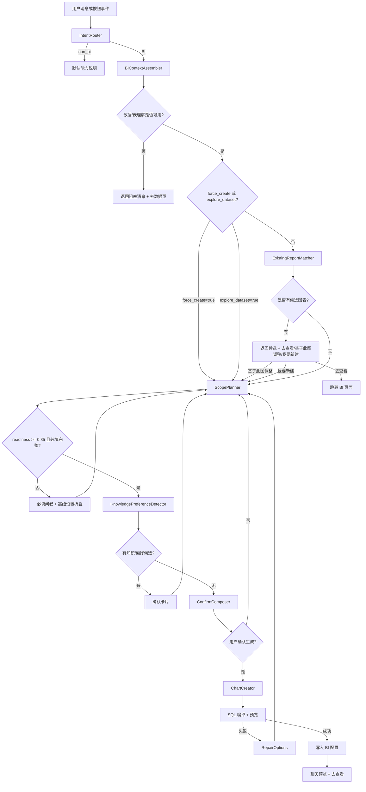

# BI 构建者开发文档

> 面向研发落地。目标是让不了解 BI 业务的人，也能按本文件实现问答页里的 BI 构建者。

---

## 1. 要做什么

在聊天页“构建者”模式中，实现一个能创建、调整、推荐和重做 BI 图表的智能体。

核心能力：

1. 判断用户是不是在聊 BI。
2. 用户明确要新建时，直接进入创建规划。
3. 用户没有明确新建时，先找已有图表候选，但只给候选，不替用户决定。
4. 匹配到已有图表时给三个按钮：`去查看`、`基于此图调整`、`我要新建`。
5. 通过 `ScopePlanning` 一次性完成需求探索、搭配推荐、批量范围、缺失信息和推荐分类。
6. 需求清楚后，再识别业务知识和用户偏好，并用确认卡片让用户决定是否保存。
7. 单图和多图都用 `chart_list`，单图只是列表长度为 1。
8. 用户不知道做什么时，主动推荐 3-5 个分析方向。
9. 创建前统一确认字段、筛选、图表类型、推荐分类和写入策略。
10. 复用现有 BI SQL builder、预览校验和 BI 配置写入能力。

---

## 2. 新增提示词数量

新增 **5 个提示词模板**。不要再拆更多，否则调用链会变慢且状态容易不一致。

| 序号 | 提示词 | 用途 | 调用时机 |
|---:|---|---|---|
| 1 | `BI_BUILDER_INTENT_ROUTER_PROMPT` | 判断意图、是否强制新建、是否数据探索、是否基于已有图调整 | 每次新用户消息入口 |
| 2 | `BI_BUILDER_SCOPE_PLANNER_PROMPT` | 一次性输出 `readiness`、`chart_list`、搭配建议、写入策略、缺失信息、推荐分类 | 进入创建/调整/探索后 |
| 3 | `BI_BUILDER_KNOWLEDGE_PREFERENCE_PROMPT` | 在需求清楚后识别业务知识和用户偏好候选 | `ScopePlanning` 后 |
| 4 | `BI_BUILDER_CONFIRM_COMPOSER_PROMPT` | 生成用户可读的确认摘要和富消息 blocks | 必填信息完整后 |
| 5 | `BI_BUILDER_REPAIR_OPTIONS_PROMPT` | SQL 预览失败或字段不可计算时，生成用户可选修正方案 | 预览失败后 |

说明：

- 现有 `bi_generation.py` 的 v3 BI 生成提示词不算在本模块内。
- SQL 生成优先复用 `MetricSpecCompiler` 和 `BISQLBuilder`，不要让 LLM 直接写最终 SQL。
- 业务知识/偏好不能放在意图判断之后立刻跑，必须在 `ScopePlanning` 后跑。

---

## 3. 总调用流程



---

## 4. 后端文件设计

### 4.1 新增文件

| 文件 | 作用 |
|---|---|
| `backend/app/agents/bi_builder_agents.py` | 5 个新增提示词和本地 Agent 类 |
| `backend/app/services/bi_builder_context.py` | 汇总表理解、字段画像、BI config、图表、分类、业务知识、用户偏好 |
| `backend/app/services/bi_builder_matcher.py` | 已有图表候选评分 |
| `backend/app/services/bi_builder_state.py` | builder session 状态读写 |
| `backend/app/services/bi_builder_service.py` | 主编排服务，串起完整流程 |
| `backend/app/services/bi_builder_creator.py` | 将 `chart_list` 编译成图表配置、执行预览、写入 BI config |
| `backend/app/models/business_knowledge.py` | 业务知识表 |
| `backend/app/models/user_preference.py` | 用户偏好表 |
| `backend/app/models/builder_session.py` | 构建者会话状态表 |

### 4.2 修改文件

| 文件 | 修改点 |
|---|---|
| `backend/app/routers/chat.py` | 新增 `/api/chat/bi-builder`，或替换 `/dashboard-build` |
| `backend/app/routers/bi.py` | 可选新增 builder chart 写入接口；也可由 service 内部写入 |
| `backend/app/agents/agent_factory.py` | 注册新增 5 个 builder agent |
| `backend/app/services/ai_service.py` | 增加 builder agent 调用方法 |
| `backend/app/services/db_service.py` | 增加业务知识、偏好、builder session 的 CRUD |
| `frontend/src/views/ChatView.vue` | 接入真实发送、富消息渲染、按钮事件 |
| `frontend/src/api/index.ts` | 增加 `biBuilderChat()` API |
| `frontend/src/views/BIView.vue` | 支持 query 定位 `category_id` 和 `chart_id` |

### 4.3 当前实现对应关系

当前代码已经按上面的边界落地，研发继续开发时不要再把逻辑塞回单个 Service：

| 设计职责 | 当前代码位置 | 说明 |
|---|---|---|
| 提示词与 Agent 类 | `backend/app/agents/bi_builder_agents.py` | 5 个提示词和 5 个 Local Agent 已注册到 `AgentFactory` |
| 智能体调用入口 | `backend/app/services/ai_service.py` | 提供 intent、scope、knowledge/preference、confirm、repair 5 个方法 |
| 上下文装配 | `backend/app/services/bi_builder_context.py` | 汇总 sheet meta、字段画像、BI config、业务知识、用户偏好 |
| 已有图表候选 | `backend/app/services/bi_builder_matcher.py` | 只返回候选，不替用户决定复用 |
| 多轮状态 | `backend/app/services/bi_builder_state.py` + `bi_builder_sessions` | 不再使用内存全局变量 |
| 业务知识 | `backend/app/models/business_knowledge.py` + DBService CRUD | 确认卡接受后写入 |
| 用户偏好 | `backend/app/models/user_preference.py` + DBService CRUD | 确认卡接受后写入 |
| 图表创建 | `backend/app/services/bi_builder_creator.py` | 优先用 `MetricSpecCompiler`/`BISQLBuilder`，失败时走确定性兜底 SQL |
| 对话编排 | `backend/app/services/bi_builder_service.py` | 只负责流程分支和事件处理 |
| 前端富消息 | `frontend/src/views/ChatView.vue` | 渲染 Markdown 表格、候选图表、问卷、高级设置、知识卡片和动作按钮 |

当前实现保留了 LLM 调用点，但每次调用有短超时；超时或异常时会回退到确定性规则。这样可以先保证功能可用，再逐步提高提示词质量。

---

## 5. 数据模型

### 5.1 Builder Session

```json
{
  "id": "builder_session_001",
  "file_id": "file_001",
  "space_id": "space_001",
  "state": "scope_planning",
  "base_chart_id": null,
  "context_chart_id": null,
  "scope_plan": {},
  "chart_list": [],
  "pending_input_ui": null,
  "created_chart_ids": [],
  "created_at": "2026-05-16T00:00:00",
  "updated_at": "2026-05-16T00:00:00"
}
```

### 5.2 Business Knowledge

```json
{
  "id": "knowledge_001",
  "file_id": "file_001",
  "table_name": "admin_1_销售明细",
  "term": "神马",
  "canonical": "神州数码",
  "knowledge_type": "alias",
  "definition": "用户确认的客户简称",
  "scope": "table",
  "status": "confirmed"
}
```

### 5.3 User Preference

```json
{
  "id": "pref_001",
  "user_id": "user_001",
  "scope": "bi_builder",
  "preference_key": "ranking_chart_type",
  "preference_value": "bar",
  "status": "confirmed"
}
```

### 5.4 Chart List

```json
[
  {
    "client_chart_id": "draft_001",
    "source": "user_request",
    "title": "各区域销售额 Top 5",
    "analysis_type": "ranking_top",
    "chart_type": "bar",
    "target_category_id": "sheet_0",
    "metric": { "field": "销售额", "aggregation": "sum", "label": "销售额" },
    "dimensions": ["区域"],
    "time_field": null,
    "filters": ["月份", "渠道"],
    "required": true,
    "write_mode": "append"
  }
]
```

---

## 6. 接口设计

### 6.1 构建者聊天接口

`POST /api/chat/bi-builder`

请求：

```json
{
  "file_id": "file_001",
  "space_id": "space_001",
  "session_id": "builder_session_001",
  "message": "创建一张各区域销售额 Top 5",
  "event": {
    "type": "user_message",
    "payload": {
      "intent_override": null,
      "base_chart_id": null,
      "context_chart_id": null,
      "form_values": null
    }
  }
}
```

按钮事件也走同一个接口：

```json
{
  "event": {
    "type": "adjust_existing",
    "payload": { "base_chart_id": "chart_sheet0_001" }
  }
}
```

响应：

```json
{
  "code": 200,
  "data": {
    "session_id": "builder_session_001",
    "state": "confirming_spec",
    "reply": {
      "content": "我已经整理好生成方案，请确认。",
      "blocks": []
    },
    "scope_plan": {},
    "chart_list": [],
    "actions": []
  }
}
```

---

## 7. 后端编排伪代码

```python
async def handle_bi_builder(req):
    session = await state.load_or_create(req.session_id, req.file_id)

    if req.event.type in ACTION_EVENTS:
        return await handle_action(req, session)

    intent = await agents.intent_router.run(build_intent_input(req, session))
    if intent["intent"] == "non_bi":
        return default_intro_reply()

    context = await context_assembler.load(req.file_id, req.space_id)
    if context.blocked:
        return blocked_reply(context)

    if intent["force_create"] or intent["intent"] == "explore_dataset":
        return await run_scope_planning(req, session, context, intent)

    candidates = matcher.match(req.message, context.bi_config)
    if candidates:
        return existing_candidate_reply(candidates)

    return await run_scope_planning(req, session, context, intent)


async def run_scope_planning(req, session, context, intent):
    scope_plan = await agents.scope_planner.run({
        "message": req.message,
        "intent": intent,
        "context": context.summary_for_llm(),
        "session": session.public_state(),
    })

    await state.update_scope(session.id, scope_plan)

    if scope_plan["readiness"] < 0.85 or scope_plan["missing_required"]:
        return required_questionnaire_reply(scope_plan)

    kp = await agents.knowledge_preference.run({
        "message": req.message,
        "scope_plan": scope_plan,
        "context": context.summary_for_llm(),
    })
    if kp["cards"]:
        return knowledge_preference_cards_reply(kp)

    confirm = await agents.confirm_composer.run({
        "scope_plan": scope_plan,
        "context": context.summary_for_llm(),
    })
    return confirm_reply(confirm)
```

---

## 8. 提示词契约

### 8.1 Intent Router

输入字段：

- `message`
- `event_type`
- `conversation_state`
- `base_chart_id`
- `context_chart_id`

输出字段：

```json
{
  "intent": "non_bi|bi_lookup|bi_create|bi_modify|bi_supplement|explore_dataset",
  "force_create": false,
  "requires_existing_match": true,
  "confidence": 0.91,
  "reason": "..."
}
```

关键规则：

- “不要用已有的”“重新创建”“新建一张” → `force_create=true`。
- 用户点“基于此图调整” → `intent=bi_modify`，必须带 `base_chart_id`。
- 用户点候选后的补充输入 → `intent=bi_supplement`，必须带 `context_chart_id`。
- “这份数据能做什么分析” → `intent=explore_dataset`。

### 8.2 Scope Planner

输入字段：

- `message`
- `intent`
- `context_summary`
- `existing_chart_candidate` 或 `base_chart`
- `business_knowledge`
- `user_preferences`
- `session_scope_plan`

输出字段：

```json
{
  "readiness": 0.91,
  "can_execute": true,
  "mode": "chart_list",
  "write_strategy": "append|adjust_existing|replace_category",
  "chart_list": [],
  "missing_required": [],
  "missing_advanced": [],
  "recommended_categories": [],
  "impact": {
    "will_create": 2,
    "will_replace_existing": 0,
    "requires_rebuild_confirmation": false
  },
  "explain_for_user": "..."
}
```

关键规则：

- 需求探索、搭配推荐、批量范围判断必须在这一条提示词里完成。
- 永远输出 `chart_list`。
- Top 5、排名、趋势、结构类需求可以推荐搭配图，但不能强制加入。
- 分类推荐要基于最终字段和跨表关系，不要在字段确认前单独锁定。
- 必填缺失项放 `missing_required`，可选项放 `missing_advanced`。

### 8.3 Knowledge Preference Detector

输入字段：

- `message`
- `scope_plan`
- `context_summary`
- `known_business_knowledge`
- `known_user_preferences`

输出字段：

```json
{
  "cards": [
    {
      "card_type": "business_knowledge|user_preference",
      "title": "是否把「神马」记为业务别名？",
      "payload": {},
      "options": []
    }
  ]
}
```

关键规则：

- 只在 `ScopePlanner` 之后调用。
- 只输出和本次 `chart_list` 有关的知识或偏好。
- 不确定时给“本次使用但不保存”。

### 8.4 Confirm Composer

输入字段：

- `scope_plan`
- `chart_list`
- `recommended_categories`
- `write_strategy`
- `impact`

输出字段：

```json
{
  "content": "我将创建 2 张图表，请确认。",
  "blocks": [
    { "type": "markdown", "content": "| 图表 | 指标 | 维度 | 筛选 | 推荐分类 |" },
    { "type": "actions", "items": [] }
  ]
}
```

关键规则：

- 多图必须用 Markdown 表格。
- 表格图字段确认必须用 Markdown 表格。
- 必须展示推荐分类和写入策略。

### 8.5 Repair Options

输入字段：

- `failed_chart`
- `error_message`
- `preview_result`
- `context_summary`

输出字段：

```json
{
  "repair_options": [
    {
      "label": "改用销售额指标",
      "action": "replace_metric",
      "payload": { "metric": "销售额" }
    }
  ]
}
```

关键规则：

- 不直接编造数据。
- 给用户可选修正项。
- 只自动修复 1 次；仍失败则让用户选择。

---

## 9. 前端组件

新增组件建议：

| 组件 | 作用 |
|---|---|
| `BuilderMessageRenderer.vue` | 根据 `blocks` 渲染不同消息块 |
| `BuilderActionBar.vue` | 渲染按钮动作 |
| `BuilderQuestionnaire.vue` | 渲染必填问卷和高级设置 |
| `BuilderConfirmCard.vue` | 渲染最终确认摘要 |
| `BuilderKnowledgeCard.vue` | 渲染业务知识和用户偏好确认 |
| `BuilderChartPreview.vue` | 根据 `chart_id` 调用图表数据接口渲染预览 |

交互要求：

- “基于此图调整”提交 `event.type=adjust_existing`。
- “我要新建”提交 `event.type=create_new`，同时设置 `intent_override=bi_create` 和 `force_create=true`。
- 补充输入必须带 `context_chart_id` 或 `base_chart_id`。
- 高级设置默认折叠。
- 最终确认卡必须支持调整字段、筛选、分类、图表列表。

---

## 10. 生成与写入规则

`bi_builder_creator.py` 处理 `chart_list`：

1. 对每个 chart draft 找到对应表 profile。
2. 转换为 `MetricSpecCompiler` 能接受的 question/spec。
3. 调用 `BISQLBuilder.build()` 生成 SQL。
4. 执行预览。
5. 失败时调用 `RepairOptions`，生成用户可选修正项。
6. 成功时组装成 BI Chart 模型。
7. `write_strategy=append`：追加到 `charts`。
8. `write_strategy=adjust_existing`：复制旧图或更新旧图，按产品选择保留原图。
9. `write_strategy=replace_category`：先生成新图，确认后归档旧图并写入新图。
10. 返回成功、失败、跳过列表。

批量结果：

```json
{
  "created": ["chart_001", "chart_002"],
  "failed": [
    {
      "client_chart_id": "draft_003",
      "reason": "缺少时间字段"
    }
  ],
  "skipped": []
}
```

---

## 11. 验收用例

| 用例 | 输入 | 必须通过的行为 |
|---|---|---|
| 非 BI | “帮我写邮件” | 返回默认能力说明 |
| 强制新建 | “不要用已有的，重新创建销售排名” | 不调用已有图表匹配 |
| 已有候选 | “看各区域销售额排名” | 返回三个按钮 |
| 基于已有调整 | 点“基于此图调整”，输入“换成折线图” | 复用 base chart 上下文 |
| 补充重入 | 候选后输入“加时间筛选” | 进入 `bi_supplement`，不丢上下文 |
| 数据探索 | “这份数据能做什么分析” | 推荐 3-5 个分析方向 |
| Top/Bottom | “做销售额 Top 5” | 推荐 Bottom 5，可加入 `chart_list` |
| 多图 | “做一组销售分析图” | 输出 `chart_list`，不是另一路流程 |
| 整分类重做 | “重做订单流水分类” | 展示影响范围并二次确认 |
| 业务知识 | “看神马销售额” | Scope 后确认“神马=神州数码” |
| 用户偏好 | “以后排名都用条形图” | Scope 后确认并保存偏好 |
| 必填/高级 | “做个销售图” | 必填和高级设置分区展示 |
| 分类依赖字段 | 选择跨表指标 | 推荐自定义分类，而不是提前锁定 Sheet 分类 |
| SQL 失败 | 选择无法计算指标 | 返回修正选项，不写入配置 |

---

## 12. 实施顺序

1. 实现后端数据模型和 DBService CRUD。
2. 实现 `BIContextAssembler`。
3. 实现 `IntentRouter` 和 `/api/chat/bi-builder` 基础闭环。
4. 实现 `ExistingReportMatcher` 和三按钮候选回复。
5. 实现 `ScopePlanner`，先只支持单图和 `chart_list`。
6. 实现必填问卷和高级设置分区。
7. 实现 `KnowledgePreferenceDetector` 和确认卡保存。
8. 实现 `ConfirmComposer`。
9. 实现 `ChartCreator`，先 append，再做 adjust 和 replace_category。
10. 前端接入富消息组件。
11. BI 页面支持 query 定位。
12. 补齐验收用例。
