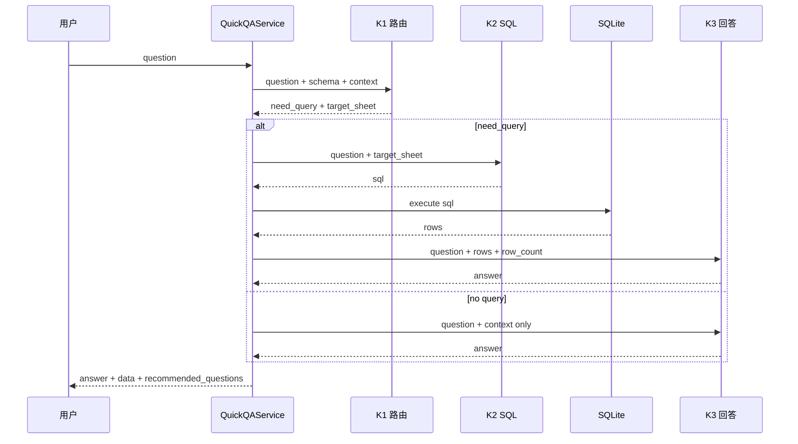

# 洞察模块方案评审与实施计划

> 结论：方案方向可行，但不能按原稿直接开工。当前最大问题不是模型数量，而是职责边界、状态流和前后端契约还没闭合。本文把「当前代码事实」「必须修改的问题」「推荐实施方案」「待确认取舍」分开，作为后续开发依据。

---

## 1. 可行性结论

洞察模块可以分阶段落地，建议顺序是：

1. 先修 **Chat 快速洞察** 的正确性：必须先查数再回答。
2. 再接 **Chat 前端真实 API**：快速问答、会话历史、当前空间/文件选择。
3. 再做 **深度洞察 SSE**：先跑通无人工确认链路，再补关键词确认暂停/恢复。
4. 最后替换 **BI 看板 Mock**：接 `bi_config` 和 `chart-data`。

不建议一开始就大规模并发化 Agent。当前更关键的是让数据流、接口参数、错误语义和前端状态对齐；并发优化应放在正确性稳定之后。

---

## 2. 当前代码事实

### 2.1 产品入口与能力线

| 用户入口 | 路由 / 模式 | 当前后端能力 | 当前前端状态 | 主要代码 |
|----------|-------------|--------------|--------------|----------|
| BI 看板 | `/bi` | 已有 BI 配置生成与图表数据 API | 仍是 Mock UI | `backend/app/routers/bi.py`, `frontend/src/components/bi/BIInsightsBoard.vue` |
| Chat 洞察 | `/chat`, `mode=insight` | `POST /api/chat/quick-qa` 已有 | UI 未接，发送提示开发中 | `backend/app/routers/chat.py`, `backend/app/services/quick_qa.py`, `frontend/src/views/ChatView.vue` |
| Chat 深度洞察 | `/chat`, `mode=deep` | `POST /api/chat/deep-research` SSE 已有 | UI 未接 SSE | `backend/app/services/deep_research.py` |
| Chat 构建者 | `/chat`, `mode=builder` | `dashboard-build` + `dashboard-layout` 已有 | UI 未接 | `backend/app/agents/dashboard_agents.py` |
| 数据理解 | `/data` | 单表六维理解 + 后台核对已有 | 已接数据页 | `backend/app/routers/understanding.py` |
| 跨表关联 | `/data/relations` | 空间关联分析 + 后台核对已有 | 已接关联页 | `backend/app/routers/relations.py` |

### 2.2 数据地基

上传后会写入：

| 数据 | 位置 | 生成方式 | 用途 |
|------|------|----------|------|
| Sheet 摘要 | `sheet_meta.summary`, `key_dimensions`, `key_metrics` | `LocalSheetSummaryAgent` | Chat/Deep/BI 的基础上下文 |
| BI 配置 | `file_records.bi_config` | `BIClassificationAgent` | BI 看板配置与图表 SQL |
| 单表理解 | `sheet_meta.understanding_content` | 用户触发 | 当前未进入 Chat 上下文 |
| 跨表关联 | `spaces.relations_content` | 用户触发 | 当前未进入 Chat 上下文 |

当前上传链路在 `backend/app/routers/upload.py` 的 `run_post_upload_analysis()` 中：

1. 按 Sheet 串行调用 `AIService.analyze_sheet()`。
2. 汇总 `sheets_data`。
3. 直接调用 `BIClassificationAgent.run()`。
4. 写入 `bi_config`，并把文件状态更新为 `analyzed`。

注意：BI Agent 当前没有走 `AIService -> AgentService`，而是在 upload/bi router 中直接实例化。

---

## 3. 当前阻塞问题

### P0：快速洞察存在「先答后查」正确性问题

当前链路：

```text
QuickQAService.answer_question()
  -> AIService.quick_qa()
  -> LocalQuickQAAgent.run()
  -> 如有 SQL，再执行 SQL
```

`LocalQuickQAAgent` 一次性输出 `answer + sql + recommended_questions`。但 SQL 是在 LLM 返回后才执行，所以 `answer` 并没有看到真实查询结果。对于任何需要算数、排序、占比、趋势的问题，这个答案都可能是臆测。

必须改成：

```text
问题 -> 意图/选表 -> SQL -> 执行 SQL -> 基于查询结果生成回答
```

### ~~P0：SQL 执行失败被吞掉~~（已修复 2026-05-25）

`quick_qa.py` 已不再在 LLM 失败时返回占位回答，也不在 SQL 执行失败时静默回退空数据；失败经路由返回 HTTP 503，`detail` 为可读文案。

### P0：深度洞察关键词确认没有真正暂停

`DeepResearchService.run_pipeline()` 在 fuzzy match 时会发 `need_confirm`，但随后自动采用 `matched_fields` 并继续跑完整流水线。

同时 `POST /api/chat/confirm-keyword` 当前没有可恢复的 pipeline session，且调用 `confirm_keyword(question="", ...)`，不能真正完成“用户确认后继续原任务”。

结论：现有确认接口不构成可用的暂停/恢复机制。前端对接时不能假设它已经闭环。

### P1：前后端 API 契约不一致

后端 `QuickQARequest` 支持：

```json
{ "file_id": "...", "question": "...", "space_id": "..." }
```

但 `frontend/src/api/index.ts` 的 `quickQA(fileId, question)` 只传 `file_id` 和 `question`，不传 `space_id`，也没有会话历史参数。后端 `QuickQARequest` 也尚未定义 `conversation_history`，虽然底层 Agent 已支持。

建议：要么后端从 `chat_history` 自动取最近消息，要么把 `conversation_history` 纳入请求体。不要让“前端维护历史”和“后端保存历史”两套机制并存但语义不清。

### P1：Chat 上下文没有使用高质量理解材料

快速洞察和深度洞察目前只使用：

- `sheet_meta.summary`
- `key_dimensions`
- `key_metrics`
- `table_schemas`

没有注入：

- `understanding_content`
- `relations_content`
- `bi_config` 中已生成的图表/KPI 定义

这会限制回答深度，尤其是字段业务含义、表间关系、指标解释。

### P1：BI 看板 API 已有，但前端仍全量 Mock

`BIView.vue` 明确显示 Mock banner，`BIInsightsBoard.vue` 从 `biInsightsMock.ts` 初始化。后端已有：

- `GET /api/bi/config/{file_id}`
- `POST /api/bi/chart-data`
- `GET /api/bi/filter-options/{file_id}`
- `POST /api/bi/regenerate-chart`

所以 BI 的主要工作不是新增后端，而是前端数据适配、加载状态、错误状态和筛选联动。

---

## 4. 推荐目标架构

### 4.1 快速洞察拆分

把 Agent K 拆成三个必需职责和一个可选职责：

| Agent | 是否必需 | 输入 | 输出 | 说明 |
|-------|----------|------|------|------|
| K1 Router | 必需 | 问题 + schema + 摘要 | `need_query`, `target_sheet`, `analysis_type`, `reason` | 判断是否需要查数 |
| K2 SQL | 必需 | 问题 + target_sheet + schema | `sql` | 只写 SQL，不写答案 |
| K3 Answer | 必需 | 问题 + SQL 结果样本 + 行数 | `answer` | 只基于真实结果回答 |
| K4 Follow-up | 可选 | 问题 + schema + 当前答案 | `recommended_questions` | 可与 K3 合并，避免过度调用 |

关键路径：



工程上可以先做“两段式”而不是四段式：

1. K-SQL：判断是否需要查询并生成 SQL。
2. K-Answer：查询后生成答案和追问。

这样能先修正 P0，同时控制调用次数。

### 4.2 深度洞察状态机

深度洞察不要继续使用“发出 need_confirm 但自动继续”的半确认模式。建议改成明确状态机：

| 状态 | 后端行为 | 前端行为 |
|------|----------|----------|
| `running` | 正常 SSE 推进 | 展示步骤 |
| `need_confirm` | 保存 session 快照并停止 SSE | 展示候选项 |
| `confirmed` | 用户提交选择后启动新 SSE 继续 | 继续展示步骤 |
| `completed` | 返回报告、图表、数据摘要 | 渲染结果 |
| `error` | 返回错误事件 | 展示可重试错误 |

如果暂时不做 session 存储，第一版应移除人工确认：fuzzy 时返回错误或自动选择但明确标注“自动选择”，不要暴露不可用的 `confirm-keyword` 流程。

### 4.3 洞察上下文构建器

建议新增一个独立上下文构建层，避免每个 router 重复拼 `sheet_metas`：

```text
InsightContextService.build(file_id, space_id, detail_level)
  -> sheets_summary
  -> table_schemas
  -> understanding_digest
  -> relations_digest
  -> bi_digest
```

`detail_level` 可以是：

| 等级 | 用途 | 内容 |
|------|------|------|
| `brief` | 快速问答 | Sheet 摘要 + 字段 + 可选理解摘要 |
| `deep` | 深度洞察 | brief + 关联摘要 + 指标解释 |
| `bi` | 看板生成 | Sheet 摘要 + 指标/维度 + 图表配置上下文 |

第一版不必引入复杂 RAG，直接做长度截断即可。

---

## 5. 并发策略

并发只用于无依赖任务。当前优先级如下：

| 环节 | 当前状态 | 建议 | 优先级 |
|------|----------|------|--------|
| Agent D/E/F 多角色拆解 | 已 `asyncio.gather` | 保持 | 已完成 |
| 深度洞察图表生成 I | 串行 for 循环 | 可按 `data_results` 并发 | P2 |
| 上传后 Sheet 摘要 A | 串行 | 可按 Sheet 并发，但要控制并发数 | P2 |
| 快速洞察 K2/K4 | 原本单 Agent | 如果拆出推荐问，可与 SQL 并行 | P3 |
| BI 分类/图表生成 | 单次大调用 | 后续可按 category 或 sheet 拆分 | P3 |

不建议把 SQL 生成 H 过早拆成多个并发调用。它会重复传表结构，增加 token 和失败面；等报告质量稳定后再优化。

---

## 6. 实施切片

### Slice 1：快速洞察正确性

后端改动：

- 新增或重构 `LocalQuickQAAgent` 为 SQL 阶段和 Answer 阶段。
- `QuickQAService` 必须执行 SQL 后再生成自然语言答案。
- SQL 校验失败、执行失败直接返回错误语义，不吞异常。
- `QuickQARequest` 明确是否接收 `conversation_history`；推荐由后端按 `space_id + file_id` 取最近历史。

验收：

- 问“销售额最高的客户是谁”时，回答中的客户必须来自 SQL 返回结果。
- 构造非法 SQL 时不会返回空数据冒充成功。
- `chat_history` 保存用户问题和助手最终答案。

### Slice 2：Chat 前端接快速洞察

前端改动：

- `ChatView.vue` 发送按钮接 `quickQA()`。
- `quickQA()` 传 `space_id` 和当前 `file_id`。
- 增加 loading、error、空文件/未分析状态。
- 推荐问题点击后直接发送真实请求，而不是只体验 Mock。

验收：

- `/chat` 洞察模式能完成真实问答。
- 切换空间后使用当前空间文件。
- 后端 400/404/500 能被用户读懂。

### Slice 3：深度洞察最小可用

后端改动：

- 先二选一：
  - A：移除人工确认，fuzzy 自动选择并在 SSE 中明确说明。
  - B：实现 session 存储和确认后继续。
- 图表生成可改为并发，但不要影响错误隔离。

前端改动：

- 接 `deep-research` SSE。
- 渲染步骤状态、子问题、图表、报告。
- 对 `error` 事件给出可重试反馈。

验收：

- 一个完整问题可以从 SSE 起步跑到 `completed`。
- 任何 Agent/SQL 错误会进入 `error`，不会卡住。

### Slice 4：BI 看板去 Mock

前端改动：

- `BIView.vue` 根据当前文件调用 `getBIConfig()`。
- `BIInsightsBoard.vue` 接收真实 `categories/charts/globalFilters`。
- 图表卡片按需调用 `getBIChartData()`。
- 筛选变化重新拉图表数据。
- 保留空状态：未上传、未分析、无 BI 配置、SQL 失败。

验收：

- Mock banner 删除。
- 每张图的数据来自 `/api/bi/chart-data`。
- 筛选器能影响图表查询结果。

### Slice 5：上下文增强

后端改动：

- 新增 `InsightContextService` 或等价 helper。
- 快速洞察注入 `understanding_content` 的摘要。
- 深度洞察注入 `relations_content` 的摘要。

验收：

- 字段业务含义类问题能引用六维理解内容。
- 跨表问题能识别表间关系，而不是只靠字段名猜测。

---

## 7. 需要一起确认的方案点

1. **关键词 fuzzy 确认要不要第一版就做暂停/恢复？**
   - 如果要高质量交互：需要 session 存储，工作量更大。
   - 如果要尽快跑通：第一版自动选择或直接要求用户改写问题。

2. **快速洞察是否允许多次 LLM 调用？**
   - 推荐允许至少两次：SQL 生成一次，结果解读一次。
   - 如果强行一次调用，无法保证“先查数再回答”。

3. **Chat 当前文件如何确定？**
   - 推荐：按当前 `space_id` 选择最新 `analyzed` 文件，前端也可显式传 `file_id`。
   - 如果一个空间内允许多文件并存，需要 UI 上让用户选择文件。

4. **`understanding_content` 是否作为洞察质量的前置条件？**
   - 推荐不是强制前置，但有则注入。
   - 如果强制前置，上传后链路会变长，用户首次可用时间增加。

5. **BI 看板是否继续上传后自动生成？**
   - 当前上传后自动生成 BI 配置，体验简单但上传慢。
   - 若文件较大或 Sheet 多，建议改成后台任务或用户进入 BI 时生成。

---

## 8. 质量标准

洞察模块的验收标准不是“LLM 能回复”，而是：

| 维度 | 标准 |
|------|------|
| 正确性 | 所有数值型结论必须来自 SQL 结果 |
| 可追溯 | 返回数据里保留 SQL 或至少保留查询结果表 |
| 失败透明 | SQL/LLM 失败有明确错误，不用空数据冒充成功 |
| 上下文质量 | 字段解释、指标口径、表间关系尽量来自已有理解材料 |
| 前端闭环 | loading、empty、error、retry、history 状态完整 |
| 成本控制 | 深度报告只传摘要/样本，不传全量数据 |

---

## 9. Agent 速查

| ID | 类名 | 源文件 | 当前职责 |
|----|------|--------|----------|
| A | `LocalSheetSummaryAgent` | `backend/app/agents/local_agents.py` | Sheet JSON 摘要 |
| C | `LocalKeywordConfirmAgent` | `backend/app/agents/local_agents.py` | 关键词匹配 |
| D/E/F | `LocalRoleDecompositionAgent` | `backend/app/agents/local_agents.py` | 三角色拆子问题 |
| G | `LocalSubQuestionSelectorAgent` | `backend/app/agents/local_agents.py` | 子问题筛选 |
| H | `LocalSQLGeneratorAgent` | `backend/app/agents/local_agents.py` | SQL 生成 |
| I | `LocalChartGeneratorAgent` | `backend/app/agents/local_agents.py` | ECharts option |
| J | `LocalReportGeneratorAgent` | `backend/app/agents/local_agents.py` | 报告 JSON |
| K | `LocalQuickQAAgent` | `backend/app/agents/local_agents.py` | 当前混合了 SQL、回答、追问，需拆 |
| L | `LocalDashboardBuilderAgent` | `backend/app/agents/dashboard_agents.py` | 看板需求收集 |
| M | `LocalDashboardLayoutAgent` | `backend/app/agents/dashboard_agents.py` | 看板布局生成 |
| — | `BIClassificationAgent` | `backend/app/agents/bi_agent.py` | BI 分类 + 图表配置 |
| — | `TableUnderstandingAgent` | `backend/app/agents/understanding_agent.py` | 六维 Markdown |
| — | `RelationsAnalysisAgent` | `backend/app/agents/relations_agent.py` | 跨表关联 Markdown |

---

## 10. 变更记录

| 日期 | 说明 |
|------|------|
| 2026-05-16 | 重写评审版：补充可行性结论、阻塞问题、实施切片、待确认取舍与验收标准 |
